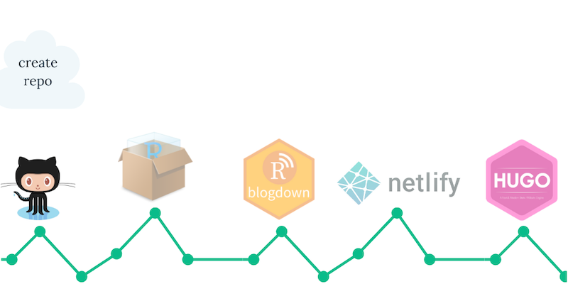
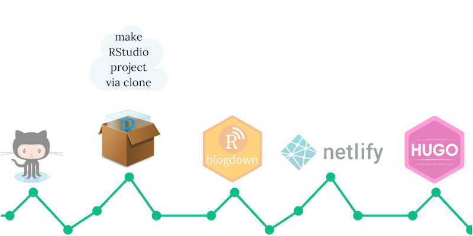
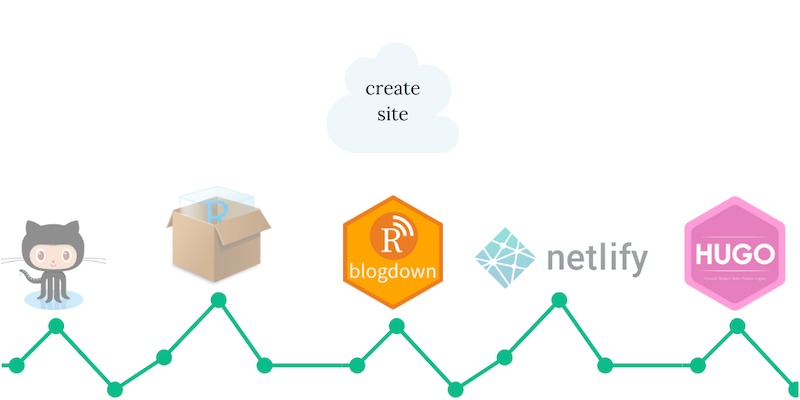
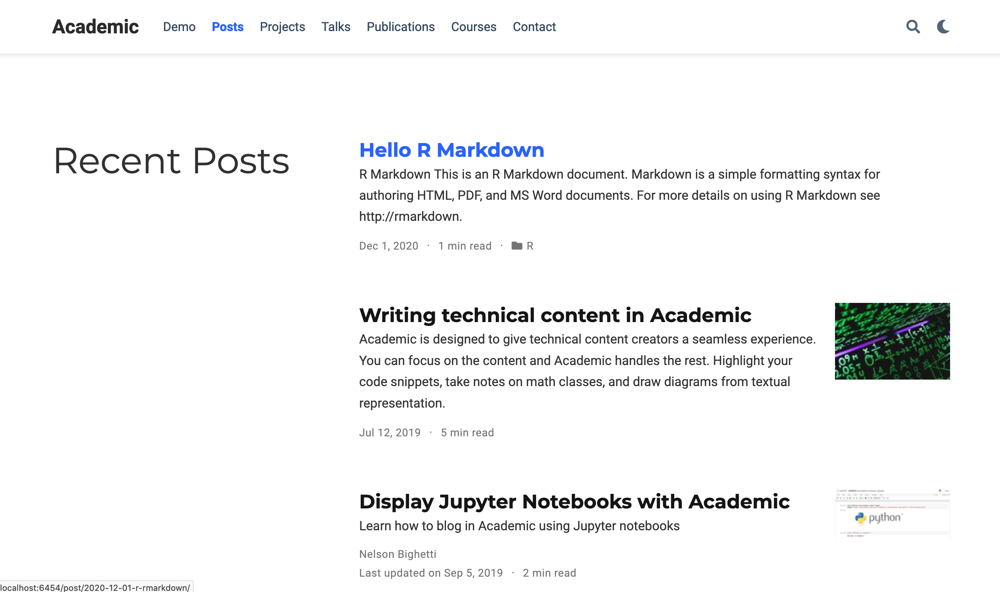
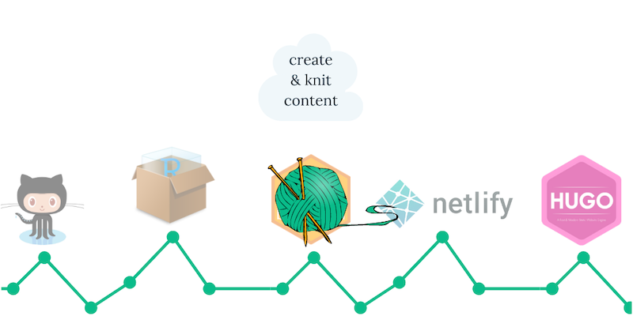
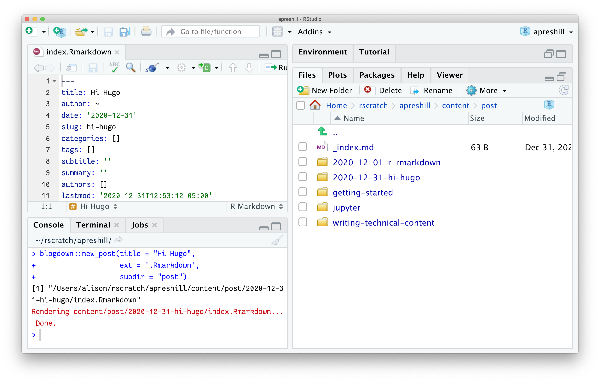
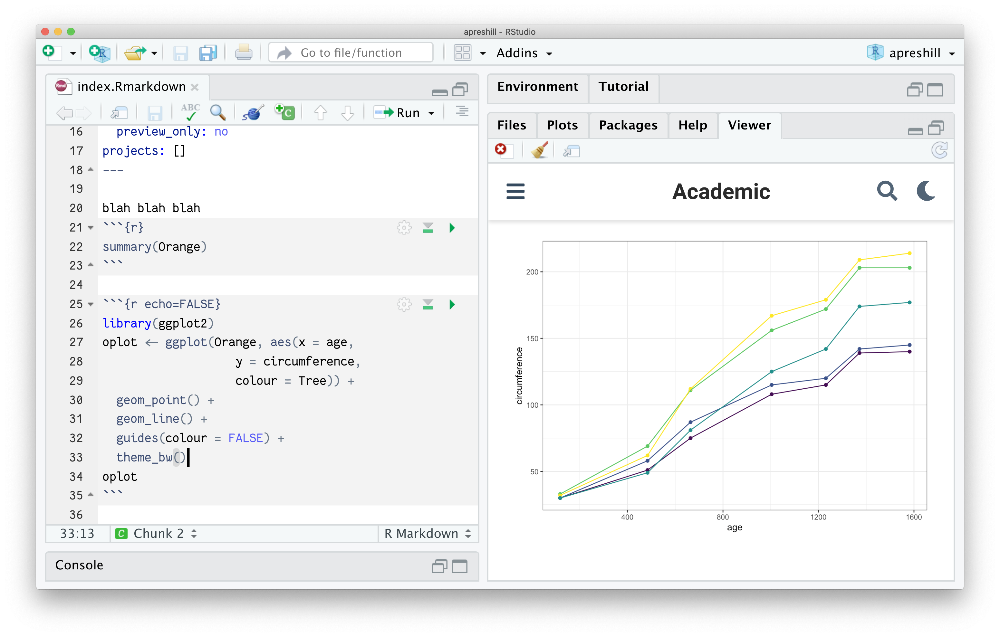
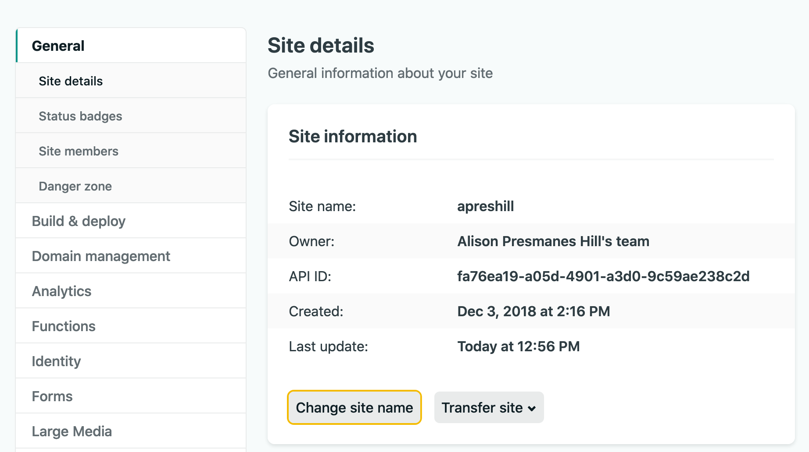
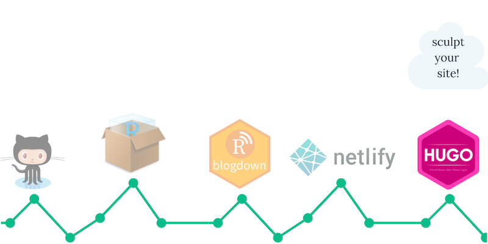

\mainmatter

# Get Started

In this chapter, we show how to create a simple website from scratch. The website will contain a home page, an "About" page, one R Markdown post, and a plain Markdown post. You will learn the basic concepts for creating websites with **blogdown**. For beginners, we recommend that you get started with the RStudio IDE, but it is not really required. The RStudio IDE can make a few things easier, but you are free to use any editor if you do not care about the extra benefits in RStudio.

## Installation

We assume you have already installed R (https://www.r-project.org) [@R-base] and the RStudio IDE (https://www.rstudio.com). If you do not have RStudio IDE installed, please install Pandoc\index{Pandoc} (http://pandoc.org). Next we need to install the **blogdown** package in R. It is available on CRAN and GitHub, and you can install it with:

```{r eval=FALSE}
## Install from CRAN
install.packages('blogdown') 
## Or, install from GitHub
if (!requireNamespace("remotes")) install.packages('remotes')
remotes::install_github('rstudio/blogdown')
```

Since **blogdown** is based on the static site generator Hugo (https://gohugo.io), you also need to install Hugo\index{Hugo}. There is a helper function in **blogdown** to download and install it automatically on major operating systems (Windows, macOS, and Linux):

```{r eval=FALSE}
blogdown::install_hugo()
```

By default, it installs the latest version of Hugo, but you can choose a specific version through the `version` argument if you prefer.


### Update

To upgrade or reinstall Hugo, you may call `blogdown::install_hugo()` again. You can check the installed Hugo version via `blogdown::hugo_version()`, and find the available or latest version(s) of Hugo at <https://github.com/gohugoio/hugo/releases>.

<!--
To update **blogdown**, use `update.packages()` or `install.packages('blogdown')`.
-->

## A quick example

From our experience, Hugo's documentation may be a little daunting to read and digest for beginners.^[One day I was almost ready to kill myself when I was trying to figure out how `_index.md` works by reading the documentation over and over again, and desperately searching on the Hugo forum.] For example, its "Quickstart" guide used to have 12 steps, and you can easily get lost if you have not used a static website generator before. For **blogdown**, we hope users of all levels can at least get started as quickly as possible. There are many things you may want to tweak for the website later, but the first step is actually fairly simple: create a new project under a new directory in the RStudio IDE (`File -> New Project`), and call the function in the R console of the new project\index{blogdown::new\_site()}:

```{r eval=FALSE}
blogdown::new_site()
```

Then wait for this function to create a new site, download the default theme, add some sample posts, open them, build the site, and launch it in the RStudio Viewer, so you can immediately preview it. If you do not use the RStudio IDE, you need to make sure you are currently in an empty directory,^[Check the output of `list.files('.')` in R, and make sure it does not include files other than `LICENSE`, the RStudio project file (`*.Rproj`), `README` or `README.md`.] in which case `new_site()` will do the same thing, but the website will be launched in your web browser instead of the RStudio Viewer.

Now you should see a bunch of directories and files under the RStudio project or your current working directory. Before we explain these new directories and files, let's introduce an important and helpful technology first: _LiveReload._\index{LiveReload} This means your website^[Until you set up your website to be deployed, LiveReload only updates the *local* version of your website. This version is only visible to you. In order to make your website searchable, discoverable, and live on the internet you will need to upload your website's files to a site builder. See Chapter \@ref(deployment) for details.] will be automatically rebuilt and reloaded in your web browser^[You can also think of the RStudio Viewer as a web browser.] when you modify any source file of your website and save it. Basically, once you launch the website in a web browser, you do not need to rebuild it explicitly anymore. All you need to do is edit the source files, such as R Markdown documents, and save them. There is no need to click any buttons or run any commands. LiveReload is implemented via `blogdown::serve_site()`\index{blogdown::serve\_site()}, which is based on the R package **servr** [@R-servr] by default.^[Hugo has its own LiveReload implementation. If you want to take advantage of it, you may set the global option `options(blogdown.generator.server = TRUE)`. See Section \@ref(livereload) for more information.]

The `new_site()` function has several arguments, and you may check out its R help page (`?blogdown::new_site`) for details. A minimal default theme named "hugo-lithium" is provided as the default theme of the new site,^[You can find its source on GitHub: https://github.com/yihui/hugo-lithium. This theme was forked from https://github.com/jrutheiser/hugo-lithium-theme and modified to work better with **blogdown**.] and you can see what it looks like in Figure \@ref(fig:lithium).

```{r lithium, fig.cap='The homepage of the default new site.', echo=FALSE, fig.align='center', out.width='90%'}
knitr::include_graphics('images/lithium-theme.png')
```

You have to know three most basic concepts for a Hugo-based website:

1. The configuration file `config.toml`\index{config.toml}, in which you can specify some global settings for your site. Even if you do not know what TOML is at this point (it will be introduced in Chapter \@ref(hugo)), you may still be able to change some obvious settings. For example, you may see configurations like these in `config.toml`:

    ```js
    baseurl = "/"
    languageCode = "en-us"
    title = "A Hugo website"
    theme = "hugo-lithium"

    [[menu.main]]
        name = "About"
        url = "/about/"
    [[menu.main]]
        name = "GitHub"
        url = "https://github.com/rstudio/blogdown"
    [[menu.main]]
        name = "Twitter"
        url = "https://twitter.com/rstudio"
    ```

    You can change the website title, e.g., `title = "My own cool website"`, and update the GitHub and Twitter URLs.\index{Directories}

1. The content directory (by default, `content/`). This is where you write the R Markdown or Markdown source files for your posts and pages. Under `content/` of the default site, you can see `about.md` and a `post/` directory containing a few posts. The organization of the content directory is up to you. You can have arbitrary files and directories there, depending on the website structure you want.

1. The publishing directory (by default, `public/`). Your website will be generated to this directory, meaning that you do not need to manually add any files to this directory.^[By running either `serve_site()` or `build_site()`, files will be generated and published in your publishing directory automatically.] Typically it contains a lot of `*.html` files and dependencies like `*.css`, `*.js`, and images. You can upload everything under `public/` to any web server that can serve static websites, and your website will be up and running. There are many options for publishing static websites, and we will talk more about them in Chapter \@ref(deployment) if you are not familiar with deploying websites.

If you are satisfied with this default theme, you are basically ready to start writing and publishing your new website! We will show how to use other themes in Section \@ref(other-themes). However, please keep in mind that a more complicated and fancier theme may require you to learn more about all the underlying technologies like the Hugo templating language, HTML, CSS, and JavaScript.


## A complete example

At this point, we've provided a quick example to get you up and running with the default Hugo theme, and we have shown you how to deploy that site using a simple drag-and-drop method. These are great beginner-friendly workflows for folks who are new to GIT, GitHub, and publishing static websites. 

In this section, we present a complete workflow that is *also* suitable for **blogdown** beginners, but is oriented toward users who are comfortable using GIT and GitHub for version control. 

### Prerequisites

#### Installations

Please follow our installation instructions from Chapter \@ref(installation).

#### Set up Netlify

Please follow our Netlify sign up instructions from Chapter \@ref(sign-up-for-netlify).

#### Set up GitHub

We will use GitHub for version control and publishing. Sign up for a free GitHub.com account at <https://github.com/join> if you don't already have one. Also:

+ Complete these installation instructions from the "Happy Git with R" https://happygitwithr.com/install-intro.html.
    
+ Test your connection between GitHub and RStudio following steps from "Happy Git with R" https://happygitwithr.com/connect-intro.html.

+ **NOTE:** We *strongly recommend* that:
    + you choose HTTPS over SSH (see https://happygitwithr.com/credential-caching.html), and
    + you setup a GitHub Personal Access Token, following these steps: https://happygitwithr.com/credential-caching.html#get-a-pat.

+ Check your new repository settings. As of October 1, 2020, GitHub will set `main` as the default branch for all new repositories, instead of `master`. To check this for your account, go to: <https://github.com/settings/repositories>
    

### tl;dr

If you already know what you are doing, this entire section can be condensed into just a few lines of code if you install the **usethis** package:

```{r eval=FALSE}
# install.packages("usethis")
usethis::create_project()
blogdown::new_site(theme = "wowchemy/starter-academic")
blogdown::serve_site()
blogdown::new_post(title = "Hi Hugo", 
                   ext = '.Rmarkdown', 
                   subdir = "post")
usethis::use_git()
usethis::use_github() # requires a GitHub PAT
```

If you'd rather follow along step-by-step, read on.

### Step 1: Create repo




1. Go online to your https://github.com account and create a new repository.

1. Since we will use Netlify to publish, you may name this repository *anything you want*^[Using GitHub Pages for publishing can be more restrictive on repository names.] 

1. Check the box to initialize with a `README` but don't add `.gitignore`- this will be taken care of later. 

1. Go to the main page of your new repository, and under the repository name, click the green **Clone or download** button.

1. Choose either SSH or HTTPS (if you don't know which, choose HTTPS). Choose by clicking on the clipboard icon to copy the remote URL for your new repository. You'll paste this text into RStudio in the next section.
    
### Step 2: Create project



We just created the remote repository on GitHub. To make a local copy on our computer that we can actually work in, we'll clone that repository into a new RStudio project. This will allow us to sync between the two locations: your remote (the one you see on github.com) and your local desktop.

Open up RStudio to create a new project where your website's files will live.
    
1. Click `File > New Project > Version Control > Git`.

1. Paste the copied URL from the previous step.

1. Be intentional about where you tell RStudio to create this new Project on your workstation.

1. Click **Create Project**.

    
### Step 3: Create site



1. Let's use our first blogdown function to create a website with the Hugo Wowchemy "starter-academic" project:

    ```r
    library(blogdown)
    new_site(theme = "wowchemy/starter-academic")
    ```

1. You should now see something like this. Take a moment to read through these messages - importantly, it tells you how to start and stop the server so you can preview your site. Importantly, when you come back to your project, note that you can use `blogdown::serve_site()` or the "Serve Site" addin to preview it locally. 

    

     Let's select `y` to let blogdown start a server for us.
    
    Click to "Show in new window" (to the right of the broom icon) to preview it in a normal browser window. When you do that, you'll be re-directed to the site's main homepage. Let's find our way back to the R Markdown post. Click on `Posts > Hello R Markdown` to read it:
    
    

    This is what blogdown gives you- everything else in the site is given to you by Hugo and your Wowchemy Hugo theme. But this post, and your ability to see output and plots knitted with R Markdown is what blogdown adds.

### Step 4: Create content



Let's use more R Markdown.

Blogdown allows you to create new two kinds of R Markdown posts that are knittable:

+ `.Rmd` to `.html` or 

+ `.Rmarkdown` to `.markdown`

Once knitted, both are then previewable in your Hugo site.

Use the console to author a new `.Rmarkdown` post; I'll name my post "Hi Hugo":

```r
blogdown::new_post(title = "Hi Hugo", 
                   ext = '.Rmarkdown', 
                  subdir = "post")
```

This takes the path to where you want your post to live, relative to the `content/` folder (so that piece of the path is assumed, rightly so!). In the Wowchemy theme, the example site organizes blog posts into the `content/post/` folder, but the name of this folder varies across Hugo themes. 

::: {.note}
A rule that is true 90% of the time: folders in `content/` are singular, not plural--- so `post`; not `posts` is the name of the folder.
:::

You can add an option to your `.Rprofile` to save these settings so you don't have to remember them:

```{r eval=FALSE}
# if exists, opens; if not, creates new
blogdown::config_Rprofile() 
```

Then add the blogdown options to that file, save, and **RESTART YOUR R SESSION** for changes to take effect:

```
options(
  # to automatically serve the site on RStudio startup, set this option to TRUE
  blogdown.serve_site.startup = FALSE,
  # to disable knitting Rmd files on save, set this option to FALSE
  blogdown.knit.on_save = FALSE     <- change
  blogdown.author = "Alison Hill",  <- add
  blogdown.ext = ".Rmarkdown",      <- add
  blogdown.subdir = "post"          <- add
)
```

::: {.caution}
Always restart your R session after editing your `.Rprofile` for changes to take effect. Don't forget to run `blogdown::serve_site()` after a restart.
:::

If you look in your **Files** pane, you can see that this creates a folder with the date and the ["slug"](https://en.wikipedia.org/wiki/Clean_URL#Slug) name of my post (`"hi-hugo"`). The actual R Markdown file is named `index.Rmarkdown`. 



This is a Hugo page bundle. Each post gets its own bundle, or folder. Inside the post bundle is where all your static images, static data files like `.csv` files should go. 

```
content/
├── posts
│   ├── 2021-01-01-hi-hugo
│   │   ├── bakers.csv
│   │   ├── image1.jpg
│   │   ├── image2.png
│   │   └── index.Rmarkdown
```

In the post itself, use the relative file path like:

```

```

Let's look at the `index.Rmarkdown`. We'll knit this `.Rmarkdown` to a `.markdown` file. To knit an `.Rmarkdown` post, you can either:

1. Use the Knit button to knit to the correct output format, or

1. Use the keyboard shortcut `Cmd+Shift+K` (Mac) or `Ctrl+Shift+K` (Windows/Linux).

After knitting, you should now see:

```
content/
├── posts
│   ├── hi-hugo
│   │   ├── bakers.csv
│   │   ├── image1.jpg
│   │   ├── image2.png
│   │   ├── index.Rmarkdown
│   │   └── index.markdown   <- new!
```

Go ahead and add an R code chunk like:

````
```{r}`r ''`
summary(Orange)
```
````

After you edit your `.Rmarkdown` post, knit. Note that knitting automatically saves the file for you. You also can just save the file without knitting- this is good for when your code still needs work and won't run as is.

::: {.note}
The most important thing here is to realize that the act of knitting creates an `index.markdown` file in the same post bundle as `index.Rmarkdown`. Because Hugo doesn't know R or R Markdown, The `index.markdown` version is what then feeds into the Hugo static site generator.
:::

Try it again! Add another R code chunk like:

````
```{r echo=FALSE}`r ''`
library(ggplot2)
oplot <- ggplot(Orange, aes(x = age, 
                   y = circumference, 
                   colour = Tree)) +
  geom_point() +
  geom_line() +
  guides(colour = FALSE) +
  theme_bw()
oplot
```
````

Knit, and you should see something like:




::: {.caution}
Many R Markdown output options for HTML documents are not going to be possible here, like tabbed sections, floating table of contents, the `code_download` button, etc. Also, HTML widgets are a little dicey currently.
:::

This is a single page. It is made with R Markdown, and happens to be a blog post, although you can use R Markdown to create content for any other content section too. 

The Wowchemy theme has a neat built-in ability to find featured images for individual posts based on a special filenaming system, if found inside a post's page bundle. To include a featured image to accompany your post and show up on your listing page (the clickable list of all your posts), add an image file with the word `featured` in the filename:

```
content/
├── posts
│   ├── hi-hugo
│   │   ├── bakers.csv
│   │   ├── image1.jpg
│   │   ├── image2.png
│   │   ├── index.Rmarkdown
│   │   ├── index.markdown   
│   │   └── featured-bakers.jpg   <- `r emo::ji("plus")`
```

#### Workflow {#complete-workflow}

Our workflow in RStudio at this point (again, just viewing locally because we haven't deployed yet) works best like this:

1. Open the RStudio project for the site.

1. Start the Hugo server using `blogdown::serve_site()` (only once due to the magic of *LiveReload*).

1. View site in the RStudio viewer pane, and open in a new browser window while you work.

1. Select existing files to edit using the file pane in RStudio.

1. After making changes, save if a plain `.md` file, or if working with an `.Rmd` or an `.Rmarkdown` document, `knit` to preview! You can use the "Knit" button to knit to the correct output format. You can also use the keyboard shortcut `Cmd+Shift+K` (Mac) or `Ctrl+Shift+K` (Windows/Linux).

1. The console will detect the change, the viewer pane will update, and (in a few seconds) your local view in your browser will also refresh. Try to avoid hitting the refresh button in your browser.

1. When happy with changes, add/commit/push changes to GitHub.


#### Using GitHub

Let's go ahead and push our changes to GitHub. First, let's make a `.gitignore` file:

```{r eval=FALSE}
file.edit(".gitignore")
```

Add this content:

```
.Rproj.user
.Rhistory
.RData
.Ruserdata
.DS_Store
Thumbs.db
```

Let's use blogdown to check this file before we do our first commit:

```{r eval=FALSE}
blogdown::check_gitignore()
```

You should see something like:
```
― Checking .gitignore
| Checking for items to remove...
○ Nothing to see here - found no items to remove.
| Checking for items you can safely ignore...
○ Found! You have safely ignored: .DS_Store, Thumbs.db
| Checking for items to ignore if you build the site on Netlify...
● [TODO] When Netlify builds your site, you can safely add to .gitignore: public, resources
― Check complete: .gitignore
```

We have a `[TODO]` item- go ahead and add `public` and `resources` on their own lines in your `.gitignore` file. We'll be configuring Netlify to build our site shortly, so go right ahead while the file is open. 

While we are at it, let's check out our content too:

```{r eval=FALSE}
blogdown::check_content()
```

You may notice a few pieces of content are flagged as `draft`. This is good to know! Read up on drafts in Hugo [here](https://bookdown.org/yihui/blogdown/content.html#yaml-metadata).

Our checks are pretty clean, so you can freely add/commit your project files to GitHub. You now should have the basic mechanics of your site working.

### Step 5: Publish site


Thus far, we've only been previewing our site locally, then pushing the source files (but not the built site) to GitHub. Let's now add Netlify to our workflow:

1. Log in to https://www.netlify.com.

1. Select: `New site from Git > Continuous Deployment: GitHub`.

1. From there, Netlify will allow you to select from your existing GitHub repositories. You'll pick the repo you've been working from with `blogdown`. Leave all settings as they are and select **Deploy Site**.

You should see something like this:


When it is done, you can click on the link to your new site! And the most magical thing of all, every time you push any changes to your site to GitHub, Netlify will detect the push, re-build, then update your published site. This is called continuous deployment, and it is the main reason to use Netlify for a blogdown site.

With a new site, Netlify will deploy your site and assign you a random subdomain name of the form `random-word-12345.netlify.app` This can be changed. Do this by navigating to your site on Netlify, then click on **Settings**. Under **Site information**, click on the *Change site name* button.



Whether you change your Netlify site name or use the random one, go back to your configuration file and change the `baseURL` there to match where Netlify is publishing your site:

```{r eval=FALSE}
rstudioapi::navigateToFile("config.yaml", line = 3)
```

You actually have most of the necessary wiring laid out for you already in your repo, which is why this worked. Our site has a `netlify.toml` file, which sets us the necessary settings for letting Netlify build our site for us and then publish it. 

You may also check it out using:

```{r eval=FALSE}
# if exists, opens; if not, creates new
blogdown::config_netlify()
```


Now, back in your local blogdown project, let's check this file with `blogdown::check_netlify()`:

```
― Checking netlify.toml...
○ Found HUGO_VERSION = 0.79.1 in [build] context of netlify.toml.
| Checking that Netlify & local Hugo versions match...
| Mismatch found:
  blogdown is using Hugo version (0.79.0) to build site locally.
  Netlify is using Hugo version (0.79.1) to build site.
● [TODO] Option 1: Change HUGO_VERSION = "0.79.0" in netlify.toml to match local version.
● [TODO] Option 2: Use blogdown::install_hugo("0.79.1") to match Netlify version, and set options(blogdown.hugo.version = "0.79.1") in .Rprofile to pin this Hugo version.
| Checking that Netlify & local Hugo publish directories match...
○ Good to go - blogdown and Netlify are using the same publish directory: public
― Check complete: netlify.toml
```

We recommend going with `Option 1` here, so follow that `[TODO]` and then run this function again to get a clean check.

When you are ready to deploy, commit your changes and push to GitHub! Watch as your site rebuilds.

### Step 6: Sculpt site



Now, we'll leave blogdown and R Markdown behind. We'll just be using Hugo and Wowchemy to build your personal website.

Let's start by running another blogdown check to `check_hugo()`:

```
> blogdown::check_hugo()
― Checking Hugo
| Checking Hugo version...
○ Found 4 versions of Hugo. You are using Hugo 0.79.0.
| Checking .Rprofile for Hugo version used by blogdown...
○ blogdown is using Hugo 0.79.0 to build site locally.
● [TODO] Also run blogdown::check_netlify() to check for possible problems with Hugo and Netlify.
― Check complete: Hugo
```

All set! We've already checked out our Netlify setup. If you wish to clean up your local Hugo installations, you may run `blogdown::remove_hugo()`.


#### Configure your site

Open up the following configuration files to personalize your site:

+ `config.yaml` (site title, description, etc.) 

+ `config/_default/params.toml` (especially fonts/themes) 

+ `config/_default/menus.toml` (includes your upper navbar)

Let's run `blogdown::check_config()` on the main `config.yaml` file before we leave:

```
― Checking config.yaml
| Checking "baseURL" setting for Hugo...
○ Found baseURL = "https://silly-dubinsky-de5482.netlify.app"; nothing to do here!
| Checking "ignoreFiles" setting for Hugo...
● [TODO] Add these items to the "ignoreFiles" setting: "\\.Rmd$", "\\.Rmarkdown$", "\\.knit\\.md$", "\\.utf8\\.md$"
| Checking setting for Hugo's Markdown renderer...
○ All set! Found the "unsafe" setting for goldmark.
― Check complete: config.yaml
```

Looks like we have a few `[TODO]` items left to add to our `config.yaml` file.


#### Goodbye Nelson B.

Let's say goodbye to [Nelson Bighetti](https://themes.gohugo.io/theme/academic/#about). Everything in this single markdown file populates what is called the `about` widget; a customized one looks like this:


Find and open the file `content/authors/admin/_index.md`. Edit the YAML metadata to change:

+ The icons and where they link to (see https://wowchemy.com/docs/page-builder/#icons)

+ Your current role and organization

+ Your interests

+ Your education

The text under the YAML is your bio; you can use markdown here. Add an `avatar.jpg` file too (it *must* be named this) to the same folder.


#### Prune widgets

Recall that on the Academic demo site (https://academic-demo.netlify.app/), the entire home page is filled with widgets. The default example site is the exact same as the demo. It sets almost every available widget to **active** to show you the range of what you could do. 

Deactivating the widgets you don't need and only activating the ones you want will help you personalize your site.

A helpful analogy here is to think of Mr. Potato Head (https://en.wikipedia.org/wiki/Mr._Potato_Head). The home page is your most prominent potato, and the widgets are all the pieces you could use. 

Each widget you see is a `*.md` file in the `content/home/` folder. The metadata at the top helps you configure each widget; namely whether it is `active` (true or false) and the widgets `weight` (ordering, actual numbers doesn't matter- only relative to the other weights).

For example, to turn off the hero widget, open the file `content/home/hero.md` and set `active = false`.

Take a few minutes about try out turning widgets off and on, and changing their order to see what you like! 


#### Transplant widgets

If you opted for a more streamlined home page with fewer widgets, you may experience *widget pruning regret*. Many are very useful, and you may wish to use widgets on *other* pages that are not the home page. In this theme, this is possible! Even if you turn off a widget on the home page, you can create what is called a widget page and add or even combine widgets there. Here are the steps^[Following the Wowchemy docs at https://sourcethemes.com/academic/docs/managing-content/#create-a-widget-page]:

1. Create a new folder in `content/`; let's call it `resume`

2. Inside `content/resume/`, add a file named `index.md`

3. Populate `content/resume/index.md` with a YAML, like this:

    ```yaml
    ---
    summary: More about my work experience
    title: "Resume"
    type: widget_page
    ---
    ```
    
::: {.caution}
The very critical line here is the `type: widget_page`---this sets you up to now copy over widgets from `content/home/` in this new folder. 
:::

4. Copy the widget `*.md` files you'd like to use into this `content/resume/` folder. Edit their metadata (weights, other info), and be sure to set `active = true`. For my own resume, I copied the *experience* and *accomplishments* widgets over.

5. If you want to access this new widget page from your top navbar, open up your `config/_default/menus.toml` and add it there, like:

    ```toml
    [[main]]
      name = "Resume"
      url = "/resume"
      weight = 50
    ```


Let's run one final check, which wraps all 5 checking functions we've used so far into a single final checklist:

```r
blogdown::check_site()
```


#### We made it!

At this point, you should be up and running with **blogdown**, GitHub, and Netlify. You now have the scaffold up and ready for your ideas, your style, and your voice. The rest of this book will dive deeper into details about each of these elements. The devil is often in the details, so we hope you are motivated to go forth and learn more. it will improve your quality of life as a **new** website owner and maintainer.


## RStudio IDE

There are a few essential RStudio addins\index{RStudio addins} to make it easy to edit and preview your website, and you can find them in the menu "Addins" on the RStudio toolbar:

- "Serve Site": This addin calls `blogdown::serve_site()` to continuously serve your website locally using the LiveReload technology, so you can live preview the website. You can continue to edit material for your site while you are previewing it.

- "New Post": This addin provides a dialog box for you to enter the metadata of your blog post, including the title, author, date, and so on. See Figure \@ref(fig:new-post) for an example. This addin actually calls the function `blogdown::new_post()` under the hood, but does a few things automatically:

    - As you type the title of the post, it will generate a filename for you, and you can edit it if you do not like the automatically generated one. In fact, you can also use this addin to create normal pages under any directories under `content/`. For example, if you want to add a resume page, you can change the filename to `resume.md` from the default `post/YYYY-mm-dd-resume.md`.

    - You can select the date from a calendar widget provided by Shiny.^[Shiny is an R package for building interactive web apps using R. Using this addin, the calendar widget allows you to view an interactive calendar by month to select dates. This is a simple use of Shiny, but you can read more about Shiny apps here: https://shiny.rstudio.com.]

    - It will scan the categories and tags of existing posts, so when you want to input categories or tags, you can select them from the dropdown menus, or create new ones.
    
    - After a new post is created, it will be automatically opened, so you can start writing the content immediately.

- "Update Metadata": This addin allows you to update the YAML metadata of the currently opened post. See Figure \@ref(fig:update-meta) for an example. The main advantage of this addin is that you can select categories and tags from dropdown menus instead of having to remember them.

- "Insert Image": This addin allows you to insert any image in your computer to your currently opened post.^[Check <https://lcolladotor.github.io/2018/03/07/blogdown-insert-image-addin> for a more in-depth explanation and for how to insert an image without using this addin.] Figure \@ref(fig:insert-image) shows how the addin looks like. This addin copies the image to the final location for your post files, and adds the Markdown/HTML code to embed the image. You can specify the width and height of the image, as well as the alternative text. The addin will show the final image file path after the image is uploaded. You can edit the path if necessary. If the image already exists, the addin will ask you whether you want to overwrite it as in Figure \@ref(fig:overwrite-image): when in doubt, change the name in the "Target file path" text input to avoid a conflict with previous images you have inserted.

```{r new-post, fig.cap='Create a new post using the RStudio addin.', fig.align='center', out.width='80%', echo=FALSE}
knitr::include_graphics('images/new-post.png')
```

```{r update-meta, fig.cap='Update the metadata of an existing post using the RStudio addin.', fig.align='center', out.width='70%', echo=FALSE}
knitr::include_graphics('images/update-meta.png')
```

```{r insert-image, fig.cap='Insert an image to an existing post using the RStudio addin.', fig.align='center', out.width='70%', echo=FALSE}
knitr::include_graphics('images/insert-image.png')
```

```{r overwrite-image, fig.cap='Overwrite the image you are inserting in your blog post.', fig.align='center', out.width='70%', echo=FALSE}
knitr::include_graphics('images/overwrite-image.png')
```

With these addins, you should rarely need to run any R commands manually after you have set up your website, since all your posts will be automatically compiled whenever you create a new post or modify an existing post due to the LiveReload feature.

If your RStudio version is at least v1.1.383,^[You may download all RStudio official releases including v1.1.383 from <https://www.rstudio.com/products/rstudio/download/>.] you can actually create a website project directly from the menu `File -> New Project -> New Directory` (see Figure \@ref(fig:new-project) and \@ref(fig:blogdown-project)).

```{r new-project, echo=FALSE, fig.cap='Create a new website project in RStudio.', out.width='80%', fig.align='center'}
knitr::include_graphics('images/new-project.png')
```

```{r blogdown-project, echo=FALSE, fig.cap='Create a website project based on blogdown.', out.width='80%', fig.align='center'}
knitr::include_graphics('images/blogdown-project.png')
```

If your website was created using the function `blogdown::new_site()` instead of the RStudio menu for the first time, you can quit RStudio and open the project again. If you go to the menu `Tools -> Project Options`, your project type should be "Website" like what you can see in Figure \@ref(fig:project-options).

Then you will see a pane in RStudio named "Build," and there is a button "Build Website." When you click this button, RStudio will call `blogdown::build_site()` to build the website. This will automatically generate files in the `public/` directory.^[Or wherever your publishing directory is located. It is `public/` by default, but it can be changed by specifying the `publishDir = "myNewDirectory"` in the `config.toml` file.] If you want to build the website and publish the output files under the `public/` manually, you are recommended to restart your R session and click this "Build Website" button every time before you publish the website, instead of publishing the `public/` folder generated continuously and automatically by `blogdown::serve_site()`, because the latter calls `blogdown::build_site(local = TRUE)`, which has some subtle differences with `blogdown::build_site(local = FALSE)` (see Section \@ref(local-preview) for details).

We strongly recommend that you uncheck the option "Preview site after building" in your RStudio project options (Figure \@ref(fig:project-options)).^[In case you wonder why: unless you have set the option `relativeurls` to `true` in `config.toml`, it requires a web server to preview the website locally, otherwise even if you can see the homepage of your website in the RStudio Viewer, most links like those links to CSS and JavaScript files are unlikely to work. When the RStudio Viewer shows you the preview, it does not actually launch a web server.] You can also uncheck the option "Re-knit current preview when supporting files change," since this option is not really useful after you call `serve_site()`.

```{r project-options, echo=FALSE, fig.cap='RStudio project options.', out.width='80%', fig.align='center'}
knitr::include_graphics('images/project-options.png')
```

## Global options\index{Global Options}

The **blogdown** package uses global options, specified in a `.Rprofile` file, to help users customize how **blogdown** works. When you create a new site, **blogdown** adds a project-level `.Rprofile` file in the root directory of your website project.

Options should be set using the syntax `options(name = value)`, and those included in a new **blogdown** site's `.Rprofile` file are presented in Table \@ref(tab:global-options-new).

```{r global-options-new, echo=FALSE}
knitr::kable(matrix(c(
  'blogdown.hugo.version', 'A valid Hugo version', 'A Hugo version number',
  'blogdown.knit.on_save', 'TRUE', 'Knit Rmd files automatically on save?',
  'blogdown.method', 'html', 'The output format of .Rmd posts',
  'blogdown.serve_site.startup', 'FALSE', 'Serve the site on RStudio startup?',
  NULL
), ncol = 3, byrow = TRUE, dimnames = list(NULL, c('Option name', 'Default', 'Meaning'))), booktabs = TRUE, caption = 'Global options for configured for new blogdown sites.')
```

Three of these options are worth further explanations:

- `blogdown.hugo.version`: You can find available Hugo versions at <https://github.com/gohugoio/hugo/releases/>, and find all locally installed Hugo versions via `blogdown::find_hugo('all')`. A common mistake when specifying this option is to omit the version number `0` at the end. For example, only Hugo v0.55.0 exists, but not v0.55, so `options(blogdown.hugo.version = '0.55')` will not work, and you must set it to `0.55.0` precisely.

- `blogdown.knit.on_save`: By default, the Rmd file is automatically knitted when it is saved. If you prefer clicking the `Knit` button in RStudio to manually knit the file, you may set this option to `FALSE`. If this option is unset, **blogdown** will set it to `TRUE` for the current R session (with a reminder message) when you click the `Knit` button.

- `blogdown.method`: By default, an `Rmd` post is compiled to `.html` via **rmarkdown** and Pandoc. You may set this option to `"markdown"` to bypass Pandoc, knit to `.md` (plain Markdown), and use Hugo's Markdown renderer (e.g., Goldmark) to render `.md` to `.html`. Basically, this option decides whether you want to use Pandoc or Hugo's Markdown renderer to render Markdown to HTML.

We recommend that you set these options in your R startup profile file. If you have never used a startup profile file before, you can check out the help page `?Rprofile`. Here, we provide a brief but incomplete introduction to orient you quickly.

A startup profile file is basically an R script that is executed when your R session is started. This is a perfect place to set global options, so you do not need to type these options again every time you start a new R session. 

There are a few things you need to know about R's startup profile file before using: 

1. You can use a global profile file `~/.Rprofile`,^[The tilde `~` denotes your home directory in your system.] or a per-project file `.Rprofile` under the root directory of your RStudio project. The former will be applied to all R sessions that you start, unless you have provided the latter to override it. 

1. The name "startup profile file" means that R only executes this file when you first start your R session. This means that when you modify and save your `.Rprofile`, you must restart R for the changes to take effect. 

1. [R will silently ignore the last line of your `.Rprofile`](https://yihui.org/en/2018/04/rprofile-trailing-newline/) if it does not have a trailing newline, so please make sure you add at least one newline to the end of your `.Rprofile`.

If you want to add a profile file to an existing **blogdown** project, or you created a new website without using `blogdown::new_site()`, you can create a boilerplate version with this command in your R console:

```{r eval=FALSE}
blogdown::config_Rprofile()
```

This is the easiest way to create or modify a per-project profile file. At the top of the file in a new **blogdown** website project, you will see this:

```r
# REMEMBER to restart R after you modify and save this file!

# First, execute the global .Rprofile if it exists. You may
# configure blogdown options there, too, so they apply to any
# blogdown projects. Feel free to ignore this part if it sounds
# too complicated to you.
if (file.exists("~/.Rprofile")) {
  base::sys.source("~/.Rprofile", envir = environment())
}
```

First, note the top message! The next section of code is necessary to execute both your project profile as well as the global profile if one exists. R only reads one startup profile file. For example, if you have a `.Rprofile` under the current directory and a global `~/.Rprofile`, only the former one will be executed when R starts up from the current directory. This code is provided for you so you may execute both a global and per-project profile file. Note that this code should only live in the project profile, and you _must not_ add it to your global `~/.Rprofile`, otherwise it will trigger an infinite recursion.

Below that, you will set your options. These can be stacked on separate lines, or you may use commas to list multiple options together:

```r
# stacked options
options(blogdown.serve_site.startup = FALSE)
options(blogdown.knit.on_save = TRUE)

# comma-separated options
options(blogdown.serve_site.startup = FALSE,
        blogdown.knit.on_save = TRUE)
```

It is up to you how to format your profile file---either way works. The **blogdown** options provided in the boilerplate profile file are just a subset of the options available. Depending on your personal preferences and the theme you choose, you may wish to set more global options as you work on your website. For example:

```{r global-options-2, echo=FALSE}
knitr::kable(matrix(c(
  'blogdown.author', '', 'The default author of new posts',
  'blogdown.ext', '.md', 'Default extension of new posts: .md / .Rmd / .Rmarkdown',
  'blogdown.subdir', 'post', 'Default subdirectory under content/ for new posts',
  'blogdown.yaml.empty', TRUE, 'Preserve empty fields in YAML?',
  NULL
), ncol = 3, byrow = TRUE, dimnames = list(NULL, c('Option name', 'Default', 'Meaning'))), booktabs = TRUE, caption = 'Additional global options that affect the behavior of blogdown.')
```

Suppose you always prefer writing `.Rmd` posts (instead of the default `.md`), and want the author of new posts to be "John Doe" by default. You can set these options in the profile file:

```{r eval=FALSE}
options(blogdown.ext = '.Rmd', blogdown.author = 'John Doe', blogdown.subdir = 'blog')
```

A nice consequence of setting these options is that when you use the RStudio addin "New Post," the fields "Author," "Subdirectory," and "Format" will be automatically populated, so you do not need to manipulate them every time, unless you want to change the defaults.

One inconvenience when using startup profile files is the case of the team-authored blog, where multiple authors collaborate on the same website project. You cannot set author-specific options using the `blogdown.author` option in a single `.Rprofile`, because this option should be different for different authors. One workaround is to set common website options in your project `.Rprofile`, then allow each individual author to set their own author-specific options in the global `~/.Rprofile` on each author's computer. If you use the boilerplate `blogdown::config_Rprofile()`, the first chunk of code at the top will ensure that the global `~/.Rprofile` is also executed if it exists. 

## R Markdown vs. Markdown {#output-format}

If you are not familiar with R Markdown\index{R Markdown}, please see Appendix \@ref(r-markdown) for a quick tutorial. When you create a new post, you have to decide whether you want to use R Markdown or plain Markdown\index{Markdown}, as you can see from Figure \@ref(fig:new-post). 

Table \@ref(tab:md-diff) summarizes the main differences between the three options, followed by detailed explanations below.

Table: (\#tab:md-diff) Differences among the three document formats.

|Feature      |.Rmd |.Rmarkdown |.md  |
|:------------|:----|:----------|:----|
|Run R code   |yes  |yes        |no   |
|Bibliography |yes  |yes        |no   |
|Task list    |maybe|yes        |yes  |
|MathJax      |yes  |maybe      |maybe|
|HTML widgets |yes  |yes        |no   |

1. You cannot execute any R code in a plain Markdown document, whereas in an R Markdown document, you can embed R code chunks (```` ```{r} ````). However, you can still embed R code in plain Markdown using the syntax for fenced code blocks ```` ```r ```` (note there are no curly braces `{}`). Such code blocks will not be executed and may be suitable for pure demonstration purposes. Below is an example of an R code chunk in R Markdown:

    ````markdown
    `r ''````{r cool-plot, fig.cap='A cool plot.'}
    plot(cars, pch = 20)  # not really cool
    ```
    ````
    
    And here is an example of an R code block in plain Markdown:
    
    ````markdown
    ```r
    1 + 1  # not executed
    ```
    ````

2. A plain Markdown post is rendered to HTML through [Blackfriday](https://gohugo.io/overview/configuration/) \index{Blackfriday}(a package written in the Go language and adopted by Hugo). An R Markdown document is compiled through the packages **rmarkdown**, **bookdown**, and Pandoc\index{Pandoc}, which means you can use most features of [Pandoc's Markdown](http://pandoc.org/MANUAL.html#pandocs-markdown) and [**bookdown**'s Markdown extensions](https://bookdown.org/yihui/bookdown/components.html) in **blogdown**. If you use R Markdown [@R-rmarkdown] with **blogdown**, we recommend that you read the documentation of Pandoc and **bookdown** at least once to know all the possible features. We will not repeat the details in this book, but list the features briefly below, which are also demonstrated on the example website https://blogdown-demo.rbind.io.

    - Inline formatting: `_italic_` / `**bold**` text and `` `inline code` ``.
    
    - Inline elements: subscripts (e.g., `H~2~0`) and superscripts (e.g., `R^2^`); links (`[text](url)`) and images ``; footnotes `text^[footnote]`.
    
    - Block-level elements: paragraphs; numbered and unnumbered section headers; ordered and unordered lists; block quotations; fenced code blocks; tables; horizontal rules.
    
    - Math expressions and equations.
    
    - Theorems and proofs.
    
    - R code blocks that can be used to produce text output (including tables) and graphics. Note that equations, theorems, tables, and figures can be numbered and cross-referenced.
    
    - Citations and bibliography.
    
    - HTML widgets, and Shiny apps embedded via `<iframe>`.

There are many differences in syntax between Blackfriday's Markdown and Pandoc's Markdown. For example, you can write a task list with Blackfriday but you could not with Pandoc until recently:^[Support for task lists was added to Pandoc with [version 2.6, released on January 2019](https://github.com/jgm/pandoc/releases/tag/2.6).]

```markdown
- [x] Write an R package.
- [ ] Write a book.
- [ ] ...
- [ ] Profit!
```

Similarly, Blackfriday does not support LaTeX math and Pandoc does. We have added the [MathJax](https://www.mathjax.org/#docs) \index{MathJax} support to the default theme ([hugo-lithium](https://github.com/yihui/hugo-lithium)) in **blogdown** to render LaTeX math on HTML pages, but there is a caveat for plain Markdown posts: you have to include inline math expressions in a pair of backticks `` `$math$` ``, e.g., `` `$S_n = \sum_{i=1}^n X_i$` ``. Similarly, math expressions of the display style have to be written in `` `$$math$$` ``. For R Markdown posts, you can use `$math$` for inline math expressions, and `$$math$$` for display-style expressions.^[The reason that we need the backticks for plain Markdown documents is that we have to prevent the LaTeX code from being interpreted as Markdown by Blackfriday. Backticks will make sure the inner content is not translated as Markdown to HTML, e.g., `` `$$x *y* z$$` `` will be converted to `<code>$$x *y* z$$</code>`. Without the backticks, it will be converted to `$$x <em>y</em> z$$`, which is not a valid LaTeX math expression for MathJax. Similar issues can arise when you have other special characters like underscores in your math expressions.]

If you find it is a pain to have to remember the differences between R Markdown and Markdown, a conservative choice is to always use R Markdown, even if your document does not contain any R code chunks. Pandoc's Markdown is much richer than Blackfriday, and there are only a small number of features unavailable in Pandoc but present in Blackfriday. The main disadvantages of using R Markdown are:

1. You may sacrifice some speed in rendering the website, but this may not be noticeable due to a caching mechanism in **blogdown** (more on this in Section \@ref(local-preview)). Hugo is very fast when processing plain Markdown files, and typically it should take less than one second to render a few hundred Markdown files.

1. You will have some intermediate HTML files in the source directory of your website, because **blogdown** has to call **rmarkdown** to pre-render `*.Rmd` files into `*.html`. You will also have intermediate folders for figures (`*_files/`) and cache (`*_cache/`) if you have plot output in R code chunks or have enabled **knitr**'s caching. Unless you care a lot about the "cleanness" of the source repository of your website (especially when you use a version control tool like GIT), these intermediate files should not matter.

In this book, we usually mean `.Rmd` files when we say "R Markdown documents," which are compiled to `.html` by default. However, there is another type of R Markdown document with the filename extension `.Rmarkdown`. Such R Markdown documents are compiled to Markdown documents with the extension `.markdown`, which will be processed by Hugo instead of Pandoc. There are two major limitations of using `.Rmarkdown` compared to `.Rmd`:

- You cannot use Markdown features only supported by Pandoc, such as fenced `Div`s.

- Math expressions only work if you apply the JavaScript solution mentioned in Section \@ref(javascript).

The main advantage of using `.Rmarkdown` is that the output files are cleaner because they are Markdown files. It can be easier for you to read the output of your posts without looking at the actual web pages rendered. This can be particularly helpful when reviewing GitHub pull requests. Note that numbered tables, figures, equations, and theorems are also supported. You cannot directly use Markdown syntax in table or figure captions, but you can use text references as a workaround (see **bookdown**'s documentation).

For any R Markdown documents (not specific to **blogdown**), you have to specify an output format. There are many [possible output formats](http://rmarkdown.rstudio.com/lesson-9.html) in the **rmarkdown** package (such as `html_document` and `pdf_document`) and other extension packages (such as `tufte::tufte_html` and `bookdown::gitbook`). Of course, the output format for websites should be HTML. We have provided an output format function `blogdown::html_page` in **blogdown**, and all R Markdown files are rendered using this format. It is based on the output format `bookdown::html_document2`, which means it has inherited a lot of features from **bookdown** in addition to features in Pandoc. For example, you can number and cross-reference math equations, figures, tables, and theorems, etc. See Chapter 2 of the **bookdown** book [@xie2016] for more details on the syntax.

Note that the output format `bookdown::html_document2` in turn inherits from `rmarkdown::html_document`, so you need to see the help page `?rmarkdown::html_document` for all possible options for the format `blogdown::html_page`. If you want to change the default values of the options of this output format, you can add an `output` field to your YAML metadata. For example, we can add a table of contents to a page, set the figure width to be 6 inches, and use the `svg` device for plots by setting these options in YAML:

```yaml
---
title: "My Awesome Post"
author: "John Doe"
date: "2017-02-14"
output:
  blogdown::html_page:
    toc: true
    fig_width: 6
    dev: "svg"
---
```

To set options for `blogdown::html_page()` globally (i.e., apply certain options to all Rmd files), you can create a `_output.yml` file under the root directory of your website. This YAML file should contain the output format directly (do not put the output format under the `output` option), e.g.,

```yaml
blogdown::html_page:
  toc: true
  fig_width: 6
  dev: "svg"
```

At the moment, not all features of `rmarkdown::html_document` are supported in **blogdown**, such as `df_print`, `code_folding`, `code_download`, and so on.

If your code chunk has graphics output, we recommend that you avoid special characters like spaces in the chunk label. Ideally, you should only use alphanumeric characters and dashes, e.g., ```` ```{r, my-label}```` instead of ```` ```{r, my label}````.

It is not recommended to change the **knitr** chunk options `fig.path` or `cache.path` in R Markdown. The default values of these options work best with **blogdown**. Please read Section \@ref(dep-path) to know the technical reasons if you prefer.

If you are working on an R Markdown post, but do not want **blogdown** to compile it, you can temporarily change its filename extension from `.Rmd` to another unknown extension such as `.Rmkd`.

## Other themes

In Hugo, themes\index{Themes} control the entire appearance and functionality of your site. So, if you care a lot about the appearance of your website, you will probably spend quite a bit of time in the beginning looking for a Hugo theme that you like from the collection listed at https://themes.gohugo.io. Please note that not all themes have been tested against **blogdown**. If you find a certain theme does not work well with **blogdown**, you may report to https://github.com/rstudio/blogdown/issues, and we will try to investigate the reason, but it can be time-consuming to learn and understand how a new theme works, so we recommend that you learn more about Hugo by yourself before asking, and we also encourage users to help each other there.

After you have found a satisfactory theme, you need to figure out its GitHub username and repository name,^[For most themes, you can find this by navigating to the theme of your choice from http://themes.gohugo.io and then clicking on `Homepage`.] then either install the theme via\index{blogdown::install\_theme()} `blogdown::install_theme()`, or just create a new site under another new directory and pass the GitHub repository name to the `theme` argument of `new_site()`. We recommend that you use the second approach, because Hugo themes could be very complicated and the usage of each theme can be very different and highly dependent on `config.toml`. If you install a theme using `install_theme()` instead of `new_site()` you’ll need to manually create the `config.toml` file in the root directory of your website to match the newly installed theme.^[In a workaround, if you used `install_theme()` and set the `theme_example` argument to TRUE, then you can access an example `config.toml` file. In the `themes/` directory, navigate to the file for your newly downloaded theme and find `exampleSite/config.toml`. This file can be copied to your root directory (to replace the `config.toml` file from your original theme) or used as a template to correctly write a new `config.toml` file for your new theme.]

```{r eval=FALSE}
# for example, create a new site with the anatole theme
blogdown::new_site(theme = 'lxndrblz/anatole')
```

To save you some time, we list a few themes below that match our taste:

- Simple/minimal themes: [XMin,](https://themes.gohugo.io/hugo-xmin/) [Tanka,](https://themes.gohugo.io/hugo-tanka/)
[Cupper,](https://themes.gohugo.io/cupper-hugo-theme/)
[simple-a,](https://themes.gohugo.io/simple-a/) and [ghostwriter.](https://themes.gohugo.io/ghostwriter/)

- Sophisticated themes: [Even,](https://themes.gohugo.io/hugo-theme-even/) [Tranquilpeak,](https://themes.gohugo.io/hugo-tranquilpeak-theme/)
[Creative portfolio,](https://themes.gohugo.io/hugo-creative-portfolio-theme/) and [Universal.](https://themes.gohugo.io/hugo-universal-theme/)

- Multimedia content themes: If you are interested in adding multimedia content to your site (such as audio files of a podcast), the [castanet](https://github.com/mattstratton/castanet) theme provides an excellent framework tailored for this application.  An example of a site using **blogdown** with the castanet theme is the [R-Podcast.](https://www.r-podcast.org)

If you do not understand HTML, CSS, or JavaScript, and have no experience with Hugo themes or templates, it may take you about 10 minutes to get started with your new website, since you have to accept everything you are given (such as the default theme); if you do have the knowledge and experience (and desire to highly customize your site), it may take you several days to get started. Hugo is really powerful. Be cautious with power.

Another thing to keep in mind is that the more effort you make in a complicated theme, the more difficult it is to switch to other themes in the future, because you may have customized a lot of things that are not straightforward to port to another theme. So please ask yourself seriously, "Do I like this fancy theme so much that I will definitely not change it in the next couple of years?"

> If you choose to dig a rather deep hole, someday you will have no choice but keep on digging, even with tears.
>
> --- Liyun Chen^[Translated from her Chinese Weibo.]

## A recommended workflow {#workflow}

There are a lot of ways to start building a website and deploy it. Because of the sheer number of technologies that you need to learn to fully understand how a website works, we'd like to recommend one workflow to beginners, so that hopefully they do not need to digest the rest of this book. This is definitely not the most optimal workflow, but requires you to know the fewest technical details.

To start a new website:

1. Carefully pick a theme at https://themes.gohugo.io, and find the link to its GitHub repository, which is of the form `https://github.com/user/repo`.

1. Create a new project in RStudio, and type the code `blogdown::new_site(theme = 'user/repo')` in the R console, where `user/repo` is from the link in Step 1.

1. Play with the new site for a while and if you do not like it, you can repeat the above steps, otherwise edit the options in `config.toml`. If you do not understand certain options, go to the documentation of the theme, which is often the README page of the GitHub repository. Not all options have to be changed.

To edit a website:

1. Click the RStudio addin "Serve Site" to preview the site in RStudio Viewer. This only needs to be done once every time you open the RStudio project or restart your R session. Do not click the `Knit` button on the RStudio toolbar.

1. Use the "New Post" addin to create a new post or page, then start writing the content.

1. Use the "Update Metadata" addin to modify the YAML metadata if necessary.

To publish a website if you are not familiar with GIT or GitHub:

1. Restart the R session, and run `blogdown::hugo_build()`. You should get a `public/` directory under the root directory of your project.

1. Log into\index{Netlify} https://www.netlify.com (you can use a GitHub account if you have one). If this is the first time you have published this website, you can create a new site, otherwise you may update the existing site you created last time. You can drag and drop the `public/` folder from your file viewer to the indicated area on the Netlify web page, where it says "Drag a folder with a static site here."

1. Wait for a few seconds for Netlify to deploy the files, and it will assign a random subdomain of the form `random-word-12345.netlify.com` to you. You can (and should) change this random subdomain to a more meaningful one if it is still available.

It can be much easier to publish a website if you are familiar with GIT and GitHub. We recommend that you create a new site on Netlify from your GitHub repository that contains the source files of your website, so that you can enjoy the benefits of continuous deployment instead of manually uploading the `public/` folder every time. With this approach, you do not need to run `blogdown::hugo_build()` locally, because the website can be built on Netlify via Hugo. See Chapter \@ref(deployment) for more information.
