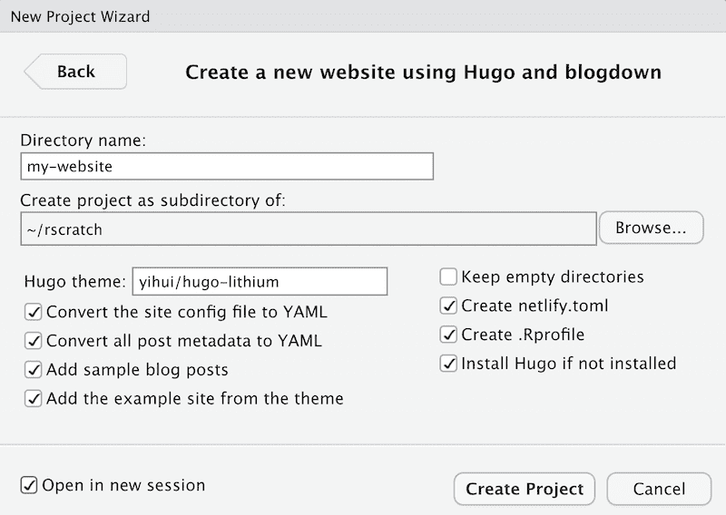
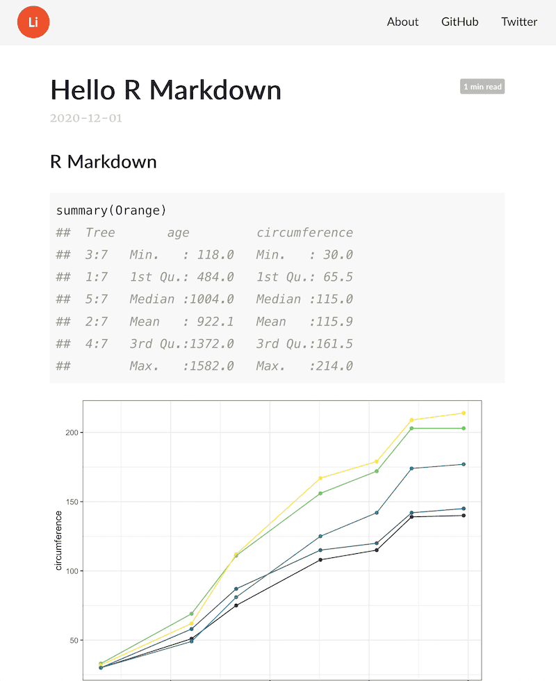

\mainmatter

# Get Started

In this chapter, we show how to create a simple website from scratch using **blogdown**. The website will contain a home page, an "About" page, one R Markdown post, and two plain Markdown posts. You will learn the basic concepts for creating websites with **blogdown**. 

We recommend using the RStudio IDE with **blogdown** because there are a number of features built-in to the R package that RStudio users can take advantage of, but it is not required. Using the RStudio IDE will make some steps in this workflow easier, but you are free to use any editor.

## Installation

We assume you have already installed:

+ R (https://www.r-project.org) [@R-base] and 
+ the RStudio IDE (https://rstudio.com/products/rstudio/download/). 

If you are not using the RStudio IDE, please install Pandoc\index{Pandoc} (http://pandoc.org). Instructions are available on the reference site (https://pandoc.org/getting-started.html).

The **blogdown** package is available on CRAN and you can install it with:

```{r eval=FALSE}
## Install from CRAN
install.packages('blogdown') 
```

To follow along with this book, we recommend using **blogdown** `r packageVersion("blogdown")` or higher. 

### Installation troubleshooting

Do you have an old version of **blogdown**? Compare your version against ours and upgrade if necessary.

```{r collapse=TRUE}
packageVersion("blogdown")
```

To update **blogdown**:

```{r eval = FALSE}
update.packages('blogdown')
# or alternatively
install.packages('blogdown')
```

Do you have an old version of **rmarkdown**? The updated version of the **blogdown** package imports the **rmarkdown** package version 2.5. If your **rmarkdown** version is out of date, it will be updated using the RStudio IDE. However, if you are experiencing problems or are not using RStudio, compare your version against ours and upgrade if necessary.

```{r collapse=TRUE}
packageVersion('rmarkdown')
```

Update the **rmarkdown** package using the same code provided above, replacing **blogdown**.

If you are still experiencing issues with **blogdown**, you may try installing the development version from GitHub:

```{r eval=FALSE}
## Or, install from GitHub
if (!requireNamespace("devtools")) install.packages('devtools')
devtools::install_github('rstudio/blogdown')
```


## A quick example

### What to expect

In this section, we aim to take you from no website to a basic **blogdown** website, with minimal time and friction. We will briefly run through the development of a working but simple website using the default theme used by the **blogdown** package. 

This section is designed to provide a beginner-friendly workflow. In later sections, we will present different workflows and dive deeper into details like advanced **blogdown** features, Hugo themes and the Hugo static site generator, version control, and deployment options. 

### Prerequisites

To keep this example *actually* quick, we will assume that you are using the RStudio IDE and will rely on some of the built-in features that help **blogdown** users.^[The instructions here rely on a recent RStudio IDE version; v1.1.383 You may download all RStudio official releases including v1.1.383 from <https://www.rstudio.com/products/rstudio/download/>.]

We also assume that you have followed the [installation instructions](#installation) in the previous section.

### Create project 

The best home for your new **blogdown** website project is inside an RStudio project. A quick way to create one is to use the RStudio New Project Wizard (`File -> New Project -> New Directory`) (see Figure \@ref(fig:new-project) and \@ref(fig:blogdown-project)).

```{r new-project, echo=FALSE, fig.cap='Create a new website project in RStudio.', out.width='80%', fig.align='center'}
knitr::include_graphics('images/new-project.png')
```

```{r blogdown-project, echo=FALSE, fig.cap='Create a website project based on blogdown.', out.width='80%', fig.align='center'}

```

Click "Create Project". The project wizard then runs a function that creates a new site for you by doing the following steps:

1. Creates and opens a new [RStudio Project](https://support.rstudio.com/hc/en-us/articles/200526207-Using-Projects) for the website.
1. Downloads and installs the default theme (called `hugo-lithium`^[You can find its source on GitHub: https://github.com/yihui/hugo-lithium. This theme was forked from https://github.com/jrutheiser/hugo-lithium-theme and modified to work better with **blogdown**.]) with an example site, 
1. Adds a sample `.Rmd` post,
1. Creates a `netlify.toml` file to help you deploy your site to [Netlify](https://www.netlify.com/), and
1. Creates an `.Rprofile` file to set your blogdown options (some are setup for you).

If you are not using RStudio, you can also create a new project under a new directory in the RStudio IDE (`File` -> `New Project`) and call the `new_site()` function in the R console of the new project: 

```{r, eval=FALSE, echo=TRUE}
blogdown::new_site()
```

You should now see a bunch of directories and files under the RStudio project. 
The project will include the following files:

| File          | Description                                                    |
|---------------|----------------------------------------------------------------|
| `config.yaml` | Hugo and theme configuration file.                             |
| `.Rprofile`   | File to set up your blogdown options.                           |
| `netlify.toml`| File to set up your [Netlify](https://www.netlify.com/) options.|
| `content/`    | Website source files to edit and add, like blog posts.         |
| `themes/`     | Hugo theme assets like layout files, CSS, etc. Do not edit!    |


After all this, your new site is ready! 

### Serve site

Before we explain these new directories and files, let's use our first **blogdown** function. It's an important one, and it is often the first one you use when you open up a **blogdown** project to start a local preview of your website.

You can use run [`blogdown::serve_site()`](https://pkgs.rstudio.com/blogdown/reference/serve_site.html) from the console or use the addin^[To stop a local preview, use `blogdown::stop_server()` or restart your R Session.]:

```{r addin, echo=FALSE, fig.cap='Use the blogdown addin to serve the site.', out.width='80%', fig.align='center'}
knitr::include_graphics('images/add-in.png')
```

After clicking on "Serve Site" from the addins menu in RStudio, you should see something that looks like this:

```{r serve-site, echo=FALSE, fig.cap='Serving the site in RStudio.', out.width='80%', fig.align='center'}

```

Serving the site did the following:

1. Started a local Hugo server to help you preview your website, and 
1. Knitted a sample `.Rmd` post to an `.html` page. You can see this from the progress message that printed to your console: `Rendering content/post/2020-12-01-r-rmarkdown/index.Rmd... Done.`

If you want to preview your site locally in your web browser, you may click on the "Show in new window" icon at the top of your RStudio viewer pane (to the right of the broom icon). You can see what it looks like in Figure \@ref(fig:lithium).

```{r lithium, fig.cap='The homepage of the default new site.', echo=FALSE, fig.align='center', out.width='90%'}
knitr::include_graphics('images/lithium-theme.png')
```

Let's introduce an important and helpful technology that you just used: _LiveReload._\index{LiveReload} Serving your site uses LiveReload, which means your website^[Until you set up your website to be deployed, LiveReload only updates the *local* version of your website. This version is only visible to you. In order to make your website searchable, discoverable, and live on the internet you will need to upload your website's files to a site builder. See Chapter \@ref(deployment) for details.] will be automatically rebuilt and reloaded in your web browser^[You can also think of the RStudio Viewer as a web browser.] when you modify any source file of your website and save it. Basically, once you launch the website in a web browser, you do not need to rebuild it explicitly anymore. All you need to do is edit the source files, such as R Markdown documents, and save them. There is no need to click any buttons or run any commands. LiveReload is implemented via this Addin that calls `blogdown::serve_site()`\index{blogdown::serve\_site()}, and you'll only need to use it once per work session.

### Edit content

Now let's see LiveReload *in action*. In your files pane, navigate inside the `content/` folder. This folder is where all your site's content lives. Find and open the file `content/post/2020-12-01-r-rmarkdown/index.Rmd`. This is a sample R Markdown post that is added by **blogdown** by default when you set up a new site. 

When you open that file, you'll notice a YAML block at the top with familiar metadata like `title` and `author`, then code chunks and narrative text below the YAML as with your typical R Markdown file.

Let's edit this `index.Rmd` post. This post is a Hugo [page bundle](https://gohugo.io/content-management/page-bundles/). Each post gets its own bundle, or folder. Inside the post bundle is where your static post-specific files like images and `.csv` files should go. 

```
content/
├── post
│   ├── 2020-12-01-r-rmarkdown
│   │   ├── index.html <- blogdown knitted this for you
│   │   └── index.Rmd
│   ├── 2015-01-01-lorem-ipsum
│   └── 2016-12-30-hello-markdown
```

The default behavior of **blogdown** is to knit posts for you automatically when you serve your site, so this file has already been knitted- that is why you can see it in your local preview. 

Go ahead and add an R code chunk to this file, like:

````
```{r}`r ''`
summary(Orange)
```
````

If you save the file with this edit, **blogdown** will re-knit the file on save, and your website preview should update after a few seconds once LiveReload kicks in.

Try it again! Add another R code chunk like:

````
```{r echo=FALSE}`r ''`
library(ggplot2)
oplot <- ggplot(Orange, aes(x = age, 
                   y = circumference, 
                   colour = Tree)) +
  geom_point() +
  geom_line() +
  guides(colour = FALSE) +
  theme_bw()
oplot
```
````

You should see a blog post that looks like this:

```{r edit-content, fig.cap='Adding new R code to an .Rmd post.', echo=FALSE, fig.align='center', out.width='80%'}

```


Any time you edit your website content, you may want to get in the habit of using one of the **blogdown** checking functions, which can help you identify problems with your content files:

```{r eval=FALSE}
blogdown::check_content()
```

These functions are meant to be used during your interactive work sessions. You'll see what files were checked, which checks were successful, and **blogdown** will offer `[TODO]` items when a check needs your attention, like this:

```
--------------------------------------------------------------------
○ A successful check looks like this.
● [TODO] A check that needs your attention looks like this.
| Let's check out your blogdown site!
--------------------------------------------------------------------
```

Checking the content of our example site should print output like this:

```
― Checking content files
| Checking for validity of YAML metadata in posts...
○ All YAML metadata appears to be syntactically valid.
| Checking for previewed content that will not be published...
○ Found 0 files with future publish dates.
○ Found 0 files marked as drafts.
| Checking your R Markdown content...
○ All R Markdown files have been knitted.
○ All R Markdown output files are up to date with their source files.
| Checking for .html/.md files to clean up...
○ Found 0 duplicate .html output files.
○ Found 0 incompatible .html files to clean up.
| Checking for the unnecessary 'content/' directory in theme...
○ Great! Your theme does not contain the content/ directory.
― Check complete: Content
```


### Configure site

We've just shown you how you can start adding `.Rmd` content to your website. However, when you are first setting up your site, you'll want to edit a few other files to personalize your site. The `config.yaml` file stores your website configurations for Hugo and for your Hugo theme. You'll usually only edit this file during the initial site setup.

For example, you may see configurations like these in `config.yaml`:

```yaml
baseurl: /
languageCode: en-us
title: A Hugo website
theme: hugo-lithium
googleAnalytics: ''
disqusShortname: ''
ignoreFiles:
- \.Rmd$
- \.Rmarkdown$
- _cache$
- \.knit\.md$
- \.utf8\.md$
permalinks:
post: /:year/:month/:day/:slug/
menu:
main:
- name: About
url: /about/
- name: GitHub
url: https://github.com/rstudio/blogdown
- name: Twitter
url: https://twitter.com/rstudio
```

You can change the website title, e.g., `title = "My own cool website"`, and update the GitHub and Twitter URLs.\index{Directories}

Again, you may want to get in the habit of using a **blogdown** checking function to help you identify problems with your config file:

```{r eval=FALSE}
blogdown::check_config()
```

You'll see output that looks like this, which gives you a future `[TODO]` item, to update your site's `baseURL` when you are ready to publish.

```
― Checking config.yaml
| Checking "baseURL" setting for Hugo...
● [TODO] Update "baseURL" to your actual URL when ready to publish.
| Checking "ignoreFiles" setting for Hugo...
○ "ignoreFiles" looks good - nothing to do here!
| Checking setting for Hugo's Markdown renderer...
○ All set! Found the "unsafe" setting for goldmark.
― Check complete: config.yaml
```

### Summary

You have now learned three of the most basic concepts for a Hugo-based website:

1. How to preview your Hugo site locally using `blogdown::serve_site()` or the RStudio addin "Serve Site".

1. How to edit the Hugo configuration file `config.yaml`\index{config.toml} to specify global settings for your site and your theme. 

1. How to edit contents inside the `content/` directory, where you write the R Markdown or Markdown source files for your posts and pages. Under `content/` of the default site, you can see `about.md` and a `post/` directory containing a few posts. The organization of the content directory is up to you. You can have arbitrary files and directories there, depending on the website structure you want.


### What is next?

If you are satisfied with this default theme, you are basically ready to start writing and publishing your new website! There are many options for publishing static websites like this one, and we will talk more about them in Chapter \@ref(deployment) if you are not familiar with deploying websites. 

We will also show how to use other themes in Section \@ref(other-themes). However, please keep in mind that a more complicated and fancier theme may require you to learn more about all the underlying technologies like the Hugo templating language, HTML, CSS, and JavaScript.

## RStudio IDE

There are a few essential RStudio addins\index{RStudio addins} to make it easy to edit and preview your website, and you can find them in the menu "Addins" on the RStudio toolbar:

- "Serve Site": This addin calls `blogdown::serve_site()` to continuously serve your website locally using the LiveReload technology, so you can live preview the website. You can continue to edit material for your site while you are previewing it.

- "New Post": This addin provides a dialog box for you to enter the metadata of your blog post, including the title, author, date, and so on. See Figure \@ref(fig:new-post) for an example. This addin actually calls the function `blogdown::new_post()` under the hood, but does a few things automatically:

    - As you type the title of the post, it will generate a filename for you, and you can edit it if you do not like the automatically generated one. In fact, you can also use this addin to create normal pages under any directories under `content/`. For example, if you want to add a resume page, you can change the filename to `resume.md` from the default `post/YYYY-mm-dd-resume.md`.

    - You can select the date from a calendar widget provided by Shiny.^[Shiny is an R package for building interactive web apps using R. Using this addin, the calendar widget allows you to view an interactive calendar by month to select dates. This is a simple use of Shiny, but you can read more about Shiny apps here: https://shiny.rstudio.com.]

    - It will scan the categories and tags of existing posts, so when you want to input categories or tags, you can select them from the dropdown menus, or create new ones.
    
    - After a new post is created, it will be automatically opened, so you can start writing the content immediately.

- "Update Metadata": This addin allows you to update the YAML metadata of the currently opened post. See Figure \@ref(fig:update-meta) for an example. The main advantage of this addin is that you can select categories and tags from dropdown menus instead of having to remember them.

- "Insert Image": This addin allows you to insert any image in your computer to your currently opened post.^[Check <https://lcolladotor.github.io/2018/03/07/blogdown-insert-image-addin> for a more in-depth explanation and for how to insert an image without using this addin.] Figure \@ref(fig:insert-image) shows how the addin looks like. This addin copies the image to the final location for your post files, and adds the Markdown/HTML code to embed the image. You can specify the width and height of the image, as well as the alternative text. The addin will show the final image file path after the image is uploaded. You can edit the path if necessary. If the image already exists, the addin will ask you whether you want to overwrite it as in Figure \@ref(fig:overwrite-image): when in doubt, change the name in the "Target file path" text input to avoid a conflict with previous images you have inserted.

```{r new-post, fig.cap='Create a new post using the RStudio addin.', fig.align='center', out.width='80%', echo=FALSE}
knitr::include_graphics('images/new-post.png')
```

```{r update-meta, fig.cap='Update the metadata of an existing post using the RStudio addin.', fig.align='center', out.width='70%', echo=FALSE}
knitr::include_graphics('images/update-meta.png')
```

```{r insert-image, fig.cap='Insert an image to an existing post using the RStudio addin.', fig.align='center', out.width='70%', echo=FALSE}
knitr::include_graphics('images/insert-image.png')
```

```{r overwrite-image, fig.cap='Overwrite the image you are inserting in your blog post.', fig.align='center', out.width='70%', echo=FALSE}
knitr::include_graphics('images/overwrite-image.png')
```

With these addins, you should rarely need to run any R commands manually after you have set up your website, since all your posts will be automatically compiled whenever you create a new post or modify an existing post due to the LiveReload feature.

If your RStudio version is at least v1.1.383,^[You may download all RStudio official releases including v1.1.383 from <https://www.rstudio.com/products/rstudio/download/>.] you can actually create a website project directly from the menu `File -> New Project -> New Directory` (see Figure \@ref(fig:new-project) and \@ref(fig:blogdown-project)).

```{r new-project, echo=FALSE, fig.cap='Create a new website project in RStudio.', out.width='80%', fig.align='center'}
knitr::include_graphics('images/new-project.png')
```

```{r blogdown-project, echo=FALSE, fig.cap='Create a website project based on blogdown.', out.width='80%', fig.align='center'}

```

If your website was created using the function `blogdown::new_site()` instead of the RStudio menu for the first time, you can quit RStudio and open the project again. If you go to the menu `Tools -> Project Options`, your project type should be "Website" like what you can see in Figure \@ref(fig:project-options).

Then you will see a pane in RStudio named "Build," and there is a button "Build Website." When you click this button, RStudio will call `blogdown::build_site()` to build the website. This will automatically generate files in the `public/` directory.^[Or wherever your publishing directory is located. It is `public/` by default, but it can be changed by specifying the `publishDir = "myNewDirectory"` in the `config.toml` file.] If you want to build the website and publish the output files under the `public/` manually, you are recommended to restart your R session and click this "Build Website" button every time before you publish the website, instead of publishing the `public/` folder generated continuously and automatically by `blogdown::serve_site()`, because the latter calls `blogdown::build_site(local = TRUE)`, which has some subtle differences with `blogdown::build_site(local = FALSE)` (see Section \@ref(local-preview) for details).

We strongly recommend that you uncheck the option "Preview site after building" in your RStudio project options (Figure \@ref(fig:project-options)).^[In case you wonder why: unless you have set the option `relativeurls` to `true` in `config.toml`, it requires a web server to preview the website locally, otherwise even if you can see the homepage of your website in the RStudio Viewer, most links like those links to CSS and JavaScript files are unlikely to work. When the RStudio Viewer shows you the preview, it does not actually launch a web server.] You can also uncheck the option "Re-knit current preview when supporting files change," since this option is not really useful after you call `serve_site()`.

```{r project-options, echo=FALSE, fig.cap='RStudio project options.', out.width='80%', fig.align='center'}
knitr::include_graphics('images/project-options.png')
```

## Global options\index{Global Options}

The **blogdown** package uses global options, specified in a `.Rprofile` file, to help users customize how **blogdown** works. When you create a new site, **blogdown** adds a project-level `.Rprofile` file in the root directory of your website project.

Options should be set using the syntax `options(name = value)`, and those included in a new **blogdown** site's `.Rprofile` file are presented in Table \@ref(tab:global-options-new).

```{r global-options-new, echo=FALSE}
knitr::kable(matrix(c(
  'blogdown.hugo.version', 'A valid Hugo version', 'A Hugo version number',
  'blogdown.knit.on_save', 'TRUE', 'Knit Rmd files automatically on save?',
  'blogdown.method', 'html', 'The output format of .Rmd posts',
  'blogdown.serve_site.startup', 'FALSE', 'Serve the site on RStudio startup?',
  NULL
), ncol = 3, byrow = TRUE, dimnames = list(NULL, c('Option name', 'Default', 'Meaning'))), booktabs = TRUE, caption = 'Global options for configured for new blogdown sites.')
```

Three of these options are worth further explanations:

- `blogdown.hugo.version`: You can find available Hugo versions at <https://github.com/gohugoio/hugo/releases/>, and find all locally installed Hugo versions via `blogdown::find_hugo('all')`. A common mistake when specifying this option is to omit the version number `0` at the end. For example, only Hugo v0.55.0 exists, but not v0.55, so `options(blogdown.hugo.version = '0.55')` will not work, and you must set it to `0.55.0` precisely.

- `blogdown.knit.on_save`: By default, the Rmd file is automatically knitted when it is saved. If you prefer clicking the `Knit` button in RStudio to manually knit the file, you may set this option to `FALSE`. If this option is unset, **blogdown** will set it to `TRUE` for the current R session (with a reminder message) when you click the `Knit` button.

- `blogdown.method`: By default, an `Rmd` post is compiled to `.html` via **rmarkdown** and Pandoc. You may set this option to `"markdown"` to bypass Pandoc, knit to `.md` (plain Markdown), and use Hugo's Markdown renderer (e.g., Goldmark) to render `.md` to `.html`. Basically, this option decides whether you want to use Pandoc or Hugo's Markdown renderer to render Markdown to HTML.

We recommend that you set these options in your R startup profile file. If you have never used a startup profile file before, you can check out the help page `?Rprofile`. Here, we provide a brief but incomplete introduction to orient you quickly.

A startup profile file is basically an R script that is executed when your R session is started. This is a perfect place to set global options, so you do not need to type these options again every time you start a new R session. 

There are a few things you need to know about R's startup profile file before using: 

1. You can use a global profile file `~/.Rprofile`,^[The tilde `~` denotes your home directory in your system.] or a per-project file `.Rprofile` under the root directory of your RStudio project. The former will be applied to all R sessions that you start, unless you have provided the latter to override it. 

1. The name "startup profile file" means that R only executes this file when you first start your R session. This means that when you modify and save your `.Rprofile`, you must restart R for the changes to take effect. 

1. [R will silently ignore the last line of your `.Rprofile`](https://yihui.org/en/2018/04/rprofile-trailing-newline/) if it does not have a trailing newline, so please make sure you add at least one newline to the end of your `.Rprofile`.

If you want to add a profile file to an existing **blogdown** project, or you created a new website without using `blogdown::new_site()`, you can create a boilerplate version with this command in your R console:

```{r eval=FALSE}
blogdown::config_Rprofile()
```

This is the easiest way to create or modify a per-project profile file. At the top of the file in a new **blogdown** website project, you will see this:

```r
# REMEMBER to restart R after you modify and save this file!

# First, execute the global .Rprofile if it exists. You may
# configure blogdown options there, too, so they apply to any
# blogdown projects. Feel free to ignore this part if it sounds
# too complicated to you.
if (file.exists("~/.Rprofile")) {
  base::sys.source("~/.Rprofile", envir = environment())
}
```

First, note the top message! The next section of code is necessary to execute both your project profile as well as the global profile if one exists. R only reads one startup profile file. For example, if you have a `.Rprofile` under the current directory and a global `~/.Rprofile`, only the former one will be executed when R starts up from the current directory. This code is provided for you so you may execute both a global and per-project profile file. Note that this code should only live in the project profile, and you _must not_ add it to your global `~/.Rprofile`, otherwise it will trigger an infinite recursion.

Below that, you will set your options. These can be stacked on separate lines, or you may use commas to list multiple options together:

```r
# stacked options
options(blogdown.serve_site.startup = FALSE)
options(blogdown.knit.on_save = TRUE)

# comma-separated options
options(blogdown.serve_site.startup = FALSE,
        blogdown.knit.on_save = TRUE)
```

It is up to you how to format your profile file---either way works. The **blogdown** options provided in the boilerplate profile file are just a subset of the options available. Depending on your personal preferences and the theme you choose, you may wish to set more global options as you work on your website. For example:

```{r global-options-2, echo=FALSE}
knitr::kable(matrix(c(
  'blogdown.author', '', 'The default author of new posts',
  'blogdown.ext', '.md', 'Default extension of new posts: .md / .Rmd / .Rmarkdown',
  'blogdown.subdir', 'post', 'Default subdirectory under content/ for new posts',
  'blogdown.yaml.empty', TRUE, 'Preserve empty fields in YAML?',
  NULL
), ncol = 3, byrow = TRUE, dimnames = list(NULL, c('Option name', 'Default', 'Meaning'))), booktabs = TRUE, caption = 'Additional global options that affect the behavior of blogdown.')
```

Suppose you always prefer writing `.Rmd` posts (instead of the default `.md`), and want the author of new posts to be "John Doe" by default. You can set these options in the profile file:

```{r eval=FALSE}
options(blogdown.ext = '.Rmd', blogdown.author = 'John Doe', blogdown.subdir = 'blog')
```

A nice consequence of setting these options is that when you use the RStudio addin "New Post," the fields "Author," "Subdirectory," and "Format" will be automatically populated, so you do not need to manipulate them every time, unless you want to change the defaults.

One inconvenience when using startup profile files is the case of the team-authored blog, where multiple authors collaborate on the same website project. You cannot set author-specific options using the `blogdown.author` option in a single `.Rprofile`, because this option should be different for different authors. One workaround is to set common website options in your project `.Rprofile`, then allow each individual author to set their own author-specific options in the global `~/.Rprofile` on each author's computer. If you use the boilerplate `blogdown::config_Rprofile()`, the first chunk of code at the top will ensure that the global `~/.Rprofile` is also executed if it exists. 

## R Markdown vs. Markdown {#output-format}

If you are not familiar with R Markdown\index{R Markdown}, please see Appendix \@ref(r-markdown) for a quick tutorial. When you create a new post, you have to decide whether you want to use R Markdown or plain Markdown\index{Markdown}, as you can see from Figure \@ref(fig:new-post). 

Table \@ref(tab:md-diff) summarizes the main differences between the three options, followed by detailed explanations below.

Table: (\#tab:md-diff) Differences among the three document formats.

|Feature      |.Rmd |.Rmarkdown |.md  |
|:------------|:----|:----------|:----|
|Run R code   |yes  |yes        |no   |
|Bibliography |yes  |yes        |no   |
|Task list    |maybe|yes        |yes  |
|MathJax      |yes  |maybe      |maybe|
|HTML widgets |yes  |yes        |no   |

1. You cannot execute any R code in a plain Markdown document, whereas in an R Markdown document, you can embed R code chunks (```` ```{r} ````). However, you can still embed R code in plain Markdown using the syntax for fenced code blocks ```` ```r ```` (note there are no curly braces `{}`). Such code blocks will not be executed and may be suitable for pure demonstration purposes. Below is an example of an R code chunk in R Markdown:

    ````markdown
    `r ''````{r cool-plot, fig.cap='A cool plot.'}
    plot(cars, pch = 20)  # not really cool
    ```
    ````
    
    And here is an example of an R code block in plain Markdown:
    
    ````markdown
    ```r
    1 + 1  # not executed
    ```
    ````

2. A plain Markdown post is rendered to HTML through [Blackfriday](https://gohugo.io/overview/configuration/) \index{Blackfriday}(a package written in the Go language and adopted by Hugo). An R Markdown document is compiled through the packages **rmarkdown**, **bookdown**, and Pandoc\index{Pandoc}, which means you can use most features of [Pandoc's Markdown](http://pandoc.org/MANUAL.html#pandocs-markdown) and [**bookdown**'s Markdown extensions](https://bookdown.org/yihui/bookdown/components.html) in **blogdown**. If you use R Markdown [@R-rmarkdown] with **blogdown**, we recommend that you read the documentation of Pandoc and **bookdown** at least once to know all the possible features. We will not repeat the details in this book, but list the features briefly below, which are also demonstrated on the example website https://blogdown-demo.rbind.io.

    - Inline formatting: `_italic_` / `**bold**` text and `` `inline code` ``.
    
    - Inline elements: subscripts (e.g., `H~2~0`) and superscripts (e.g., `R^2^`); links (`[text](url)`) and images ``; footnotes `text^[footnote]`.
    
    - Block-level elements: paragraphs; numbered and unnumbered section headers; ordered and unordered lists; block quotations; fenced code blocks; tables; horizontal rules.
    
    - Math expressions and equations.
    
    - Theorems and proofs.
    
    - R code blocks that can be used to produce text output (including tables) and graphics. Note that equations, theorems, tables, and figures can be numbered and cross-referenced.
    
    - Citations and bibliography.
    
    - HTML widgets, and Shiny apps embedded via `<iframe>`.

There are many differences in syntax between Blackfriday's Markdown and Pandoc's Markdown. For example, you can write a task list with Blackfriday but you could not with Pandoc until recently:^[Support for task lists was added to Pandoc with [version 2.6, released on January 2019](https://github.com/jgm/pandoc/releases/tag/2.6).]

```markdown
- [x] Write an R package.
- [ ] Write a book.
- [ ] ...
- [ ] Profit!
```

Similarly, Blackfriday does not support LaTeX math and Pandoc does. We have added the [MathJax](https://www.mathjax.org/#docs) \index{MathJax} support to the default theme ([hugo-lithium](https://github.com/yihui/hugo-lithium)) in **blogdown** to render LaTeX math on HTML pages, but there is a caveat for plain Markdown posts: you have to include inline math expressions in a pair of backticks `` `$math$` ``, e.g., `` `$S_n = \sum_{i=1}^n X_i$` ``. Similarly, math expressions of the display style have to be written in `` `$$math$$` ``. For R Markdown posts, you can use `$math$` for inline math expressions, and `$$math$$` for display-style expressions.^[The reason that we need the backticks for plain Markdown documents is that we have to prevent the LaTeX code from being interpreted as Markdown by Blackfriday. Backticks will make sure the inner content is not translated as Markdown to HTML, e.g., `` `$$x *y* z$$` `` will be converted to `<code>$$x *y* z$$</code>`. Without the backticks, it will be converted to `$$x <em>y</em> z$$`, which is not a valid LaTeX math expression for MathJax. Similar issues can arise when you have other special characters like underscores in your math expressions.]

If you find it is a pain to have to remember the differences between R Markdown and Markdown, a conservative choice is to always use R Markdown, even if your document does not contain any R code chunks. Pandoc's Markdown is much richer than Blackfriday, and there are only a small number of features unavailable in Pandoc but present in Blackfriday. The main disadvantages of using R Markdown are:

1. You may sacrifice some speed in rendering the website, but this may not be noticeable due to a caching mechanism in **blogdown** (more on this in Section \@ref(local-preview)). Hugo is very fast when processing plain Markdown files, and typically it should take less than one second to render a few hundred Markdown files.

1. You will have some intermediate HTML files in the source directory of your website, because **blogdown** has to call **rmarkdown** to pre-render `*.Rmd` files into `*.html`. You will also have intermediate folders for figures (`*_files/`) and cache (`*_cache/`) if you have plot output in R code chunks or have enabled **knitr**'s caching. Unless you care a lot about the "cleanness" of the source repository of your website (especially when you use a version control tool like GIT), these intermediate files should not matter.

In this book, we usually mean `.Rmd` files when we say "R Markdown documents," which are compiled to `.html` by default. However, there is another type of R Markdown document with the filename extension `.Rmarkdown`. Such R Markdown documents are compiled to Markdown documents with the extension `.markdown`, which will be processed by Hugo instead of Pandoc. There are two major limitations of using `.Rmarkdown` compared to `.Rmd`:

- You cannot use Markdown features only supported by Pandoc, such as fenced `Div`s.

- Math expressions only work if you apply the JavaScript solution mentioned in Section \@ref(javascript).

The main advantage of using `.Rmarkdown` is that the output files are cleaner because they are Markdown files. It can be easier for you to read the output of your posts without looking at the actual web pages rendered. This can be particularly helpful when reviewing GitHub pull requests. Note that numbered tables, figures, equations, and theorems are also supported. You cannot directly use Markdown syntax in table or figure captions, but you can use text references as a workaround (see **bookdown**'s documentation).

For any R Markdown documents (not specific to **blogdown**), you have to specify an output format. There are many [possible output formats](http://rmarkdown.rstudio.com/lesson-9.html) in the **rmarkdown** package (such as `html_document` and `pdf_document`) and other extension packages (such as `tufte::tufte_html` and `bookdown::gitbook`). Of course, the output format for websites should be HTML. We have provided an output format function `blogdown::html_page` in **blogdown**, and all R Markdown files are rendered using this format. It is based on the output format `bookdown::html_document2`, which means it has inherited a lot of features from **bookdown** in addition to features in Pandoc. For example, you can number and cross-reference math equations, figures, tables, and theorems, etc. See Chapter 2 of the **bookdown** book [@xie2016] for more details on the syntax.

Note that the output format `bookdown::html_document2` in turn inherits from `rmarkdown::html_document`, so you need to see the help page `?rmarkdown::html_document` for all possible options for the format `blogdown::html_page`. If you want to change the default values of the options of this output format, you can add an `output` field to your YAML metadata. For example, we can add a table of contents to a page, set the figure width to be 6 inches, and use the `svg` device for plots by setting these options in YAML:

```yaml
---
title: "My Awesome Post"
author: "John Doe"
date: "2017-02-14"
output:
  blogdown::html_page:
    toc: true
    fig_width: 6
    dev: "svg"
---
```

To set options for `blogdown::html_page()` globally (i.e., apply certain options to all Rmd files), you can create a `_output.yml` file under the root directory of your website. This YAML file should contain the output format directly (do not put the output format under the `output` option), e.g.,

```yaml
blogdown::html_page:
  toc: true
  fig_width: 6
  dev: "svg"
```

At the moment, not all features of `rmarkdown::html_document` are supported in **blogdown**, such as `df_print`, `code_folding`, `code_download`, and so on.

If your code chunk has graphics output, we recommend that you avoid special characters like spaces in the chunk label. Ideally, you should only use alphanumeric characters and dashes, e.g., ```` ```{r, my-label}```` instead of ```` ```{r, my label}````.

It is not recommended to change the **knitr** chunk options `fig.path` or `cache.path` in R Markdown. The default values of these options work best with **blogdown**. Please read Section \@ref(dep-path) to know the technical reasons if you prefer.

If you are working on an R Markdown post, but do not want **blogdown** to compile it, you can temporarily change its filename extension from `.Rmd` to another unknown extension such as `.Rmkd`.

## Other themes

In Hugo, themes\index{Themes} control the entire appearance and functionality of your site. So, if you care a lot about the appearance of your website, you will probably spend quite a bit of time in the beginning looking for a Hugo theme that you like from the collection listed at https://themes.gohugo.io. Please note that not all themes have been tested against **blogdown**. If you find a certain theme does not work well with **blogdown**, you may report to https://github.com/rstudio/blogdown/issues, and we will try to investigate the reason, but it can be time-consuming to learn and understand how a new theme works, so we recommend that you learn more about Hugo by yourself before asking, and we also encourage users to help each other there.

After you have found a satisfactory theme, you need to figure out its GitHub username and repository name,^[For most themes, you can find this by navigating to the theme of your choice from http://themes.gohugo.io and then clicking on `Homepage`.] then either install the theme via\index{blogdown::install\_theme()} `blogdown::install_theme()`, or just create a new site under another new directory and pass the GitHub repository name to the `theme` argument of `new_site()`. We recommend that you use the second approach, because Hugo themes could be very complicated and the usage of each theme can be very different and highly dependent on `config.toml`. If you install a theme using `install_theme()` instead of `new_site()` you’ll need to manually create the `config.toml` file in the root directory of your website to match the newly installed theme.^[In a workaround, if you used `install_theme()` and set the `theme_example` argument to TRUE, then you can access an example `config.toml` file. In the `themes/` directory, navigate to the file for your newly downloaded theme and find `exampleSite/config.toml`. This file can be copied to your root directory (to replace the `config.toml` file from your original theme) or used as a template to correctly write a new `config.toml` file for your new theme.]

```{r eval=FALSE}
# for example, create a new site with the anatole theme
blogdown::new_site(theme = 'lxndrblz/anatole')
```

To save you some time, we list a few themes below that match our taste:

- Simple/minimal themes: [XMin,](https://themes.gohugo.io/hugo-xmin/) [Tanka,](https://themes.gohugo.io/hugo-tanka/)
[Cupper,](https://themes.gohugo.io/cupper-hugo-theme/)
[simple-a,](https://themes.gohugo.io/simple-a/) and [ghostwriter.](https://themes.gohugo.io/ghostwriter/)

- Sophisticated themes: [Even,](https://themes.gohugo.io/hugo-theme-even/) [Tranquilpeak,](https://themes.gohugo.io/hugo-tranquilpeak-theme/)
[Creative portfolio,](https://themes.gohugo.io/hugo-creative-portfolio-theme/) and [Universal.](https://themes.gohugo.io/hugo-universal-theme/)

- Multimedia content themes: If you are interested in adding multimedia content to your site (such as audio files of a podcast), the [castanet](https://github.com/mattstratton/castanet) theme provides an excellent framework tailored for this application.  An example of a site using **blogdown** with the castanet theme is the [R-Podcast.](https://www.r-podcast.org)

If you do not understand HTML, CSS, or JavaScript, and have no experience with Hugo themes or templates, it may take you about 10 minutes to get started with your new website, since you have to accept everything you are given (such as the default theme); if you do have the knowledge and experience (and desire to highly customize your site), it may take you several days to get started. Hugo is really powerful. Be cautious with power.

Another thing to keep in mind is that the more effort you make in a complicated theme, the more difficult it is to switch to other themes in the future, because you may have customized a lot of things that are not straightforward to port to another theme. So please ask yourself seriously, "Do I like this fancy theme so much that I will definitely not change it in the next couple of years?"

> If you choose to dig a rather deep hole, someday you will have no choice but keep on digging, even with tears.
>
> --- Liyun Chen^[Translated from her Chinese Weibo.]

## A recommended workflow {#workflow}

There are a lot of ways to start building a website and deploy it. Because of the sheer number of technologies that you need to learn to fully understand how a website works, we'd like to recommend one workflow to beginners, so that hopefully they do not need to digest the rest of this book. This is definitely not the most optimal workflow, but requires you to know the fewest technical details.

To start a new website:

1. Carefully pick a theme at https://themes.gohugo.io, and find the link to its GitHub repository, which is of the form `https://github.com/user/repo`.

1. Create a new project in RStudio, and type the code `blogdown::new_site(theme = 'user/repo')` in the R console, where `user/repo` is from the link in Step 1.

1. Play with the new site for a while and if you do not like it, you can repeat the above steps, otherwise edit the options in `config.toml`. If you do not understand certain options, go to the documentation of the theme, which is often the README page of the GitHub repository. Not all options have to be changed.

To edit a website:

1. Click the RStudio addin "Serve Site" to preview the site in RStudio Viewer. This only needs to be done once every time you open the RStudio project or restart your R session. Do not click the `Knit` button on the RStudio toolbar.

1. Use the "New Post" addin to create a new post or page, then start writing the content.

1. Use the "Update Metadata" addin to modify the YAML metadata if necessary.

To publish a website if you are not familiar with GIT or GitHub:

1. Restart the R session, and run `blogdown::hugo_build()`. You should get a `public/` directory under the root directory of your project.

1. Log into\index{Netlify} https://www.netlify.com (you can use a GitHub account if you have one). If this is the first time you have published this website, you can create a new site, otherwise you may update the existing site you created last time. You can drag and drop the `public/` folder from your file viewer to the indicated area on the Netlify web page, where it says "Drag a folder with a static site here."

1. Wait for a few seconds for Netlify to deploy the files, and it will assign a random subdomain of the form `random-word-12345.netlify.com` to you. You can (and should) change this random subdomain to a more meaningful one if it is still available.

It can be much easier to publish a website if you are familiar with GIT and GitHub. We recommend that you create a new site on Netlify from your GitHub repository that contains the source files of your website, so that you can enjoy the benefits of continuous deployment instead of manually uploading the `public/` folder every time. With this approach, you do not need to run `blogdown::hugo_build()` locally, because the website can be built on Netlify via Hugo. See Chapter \@ref(deployment) for more information.
