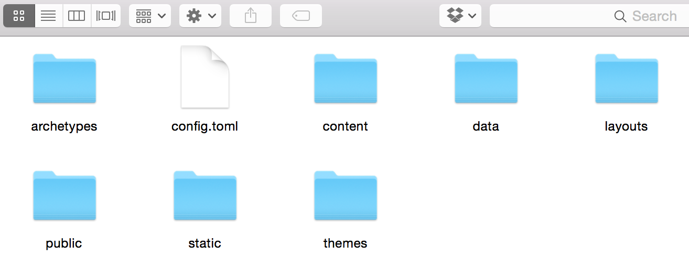
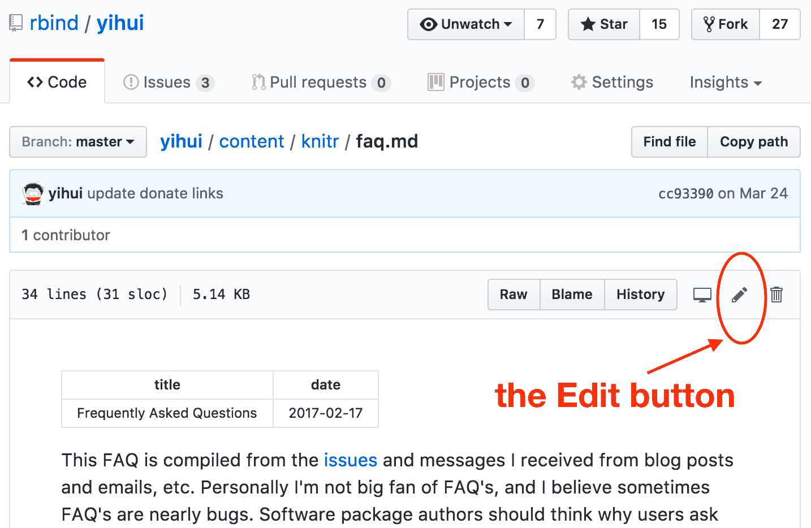

# Hugo

In this chapter, we will briefly introduce [Hugo](https://gohugo.io), the static site generator on which **blogdown** is based. This chapter is not meant to replace the official Hugo documentation, but provide a guide to those who are just getting started with Hugo. When in doubt, please consult the official Hugo documentation.

## Static sites and Hugo {#static-sites}

A static site often consists of HTML files (with optional external dependencies like images and JavaScript libraries), and the web server sends exactly the same content to the web browser no matter who visits the web pages. There is no dynamic computing on the server when a page is requested. By comparison, a dynamic site relies on a server-side language to do certain computing and sends potentially different content depending on different conditions. A common language is PHP, and a typical example of a dynamic site is a web forum. For example, each user has a profile page, but typically this does not mean the server has stored a different HTML profile page for every single user. Instead, the server will fetch the user data from a database, and render the profile page dynamically.

For a static site, each URL you visit often has a corresponding HTML file stored on the server, so there is no need to compute anything before serving the file to visitors. This means static sites tend to be faster in response time than dynamic sites, and it is also much easier to deploy, since the deployment simply means to copy static files to a server. A dynamic site often relies on databases, and you will have to install more software packages to server a dynamic site. For more advantages of static sites, please read the [introduction](https://gohugo.io/overview/introduction/) on Hugo's website.

There are many existing static site generators, including Hugo, [Jekyll](http://jekyllrb.com), and [Hexo](https://hexo.io), etc. Most of them can build general-purpose websites but are often used to build blogs.

We love Hugo for many reasons but there are a few that stand out. Unlike other static site generators, the installation of Hugo is very simple because it provides a single executable without dependencies for most operating systems (see Section \@ref(installation)). It was also designed to render hundreds of pages of content faster than comparable static site generators and can reportedly render a single page in approximately 1 millisecond. Lastly, the community of Hugo users is very active both on the [Hugo discussion forum](https://discuss.gohugo.io) and on [GitHub issues](https://github.com/gohugoio/hugo/issues).

Although we think Hugo is a fantastic static site generator, there is really one and only one major missing feature: the support for R Markdown. That is basically the whole point of the **blogdown** package.^[Another motivation was an easier way to create new pages or posts. Static site generators often provide commands to create new posts, but you often have to open and modify the new file created by hand after using these commands. I was very frustrated by this, because I was looking for a graphical user interface where I can just fill out the title, author, date, and other information about a page, then I can start writing the content right away. That is why I provided the RStudio addin "New Post" and the function `blogdown::new_post()`. In the past few years, I hated it every time I was about to create a new post either by hand or via the Jekyll command line. Finally I felt addicted to blogging again after I finished the RStudio addin.] This missing feature means that you cannot easily generate results using R code on your web pages, since you can only use static Markdown documents. Besides, you have to use Hugo's choice of the Markdown engine named "Blackfriday" instead of the more powerful Pandoc.^[There is a feature request in Hugo's repository that has been more than three years old: https://github.com/gohugoio/hugo/issues/234, and it seems that it will not be implemented in the near future.]

Hugo uses a special file and folder structure to create your website (Figure \@ref(fig:folders)). The rest of this chapter will give more details on the following files and folders:

- `config.toml`
- `content/`
- `static/`
- `themes/`
- `layouts/`

(ref:folders) Possible files and folders created when you create a new site using **blogdown**.

```{r folders, fig.cap='(ref:folders)', echo=FALSE, fig.align='center', out.width='90%'}

```

## Configuration

The first file that you may want to look at is the configuration or `config` file, in which you can set global configurations of your site. It may contain options like the title and description of your site, as well as other global options like links to your social networks, the navigation menu, and the base URL for your website.

When generating your site, Hugo will search for a file called `config.toml` first. If it cannot find one, it will continue to search for `config.yaml`.^[Hugo also supports `config.json`, but **blogdown** does not support it, so we do not recommend you to use it.] Since most Hugo themes contain example sites that ship `config.toml` files, and the TOML (Tom's Obvious, Minimal Language) format appears to be more popular in the Hugo community, we will mainly discuss `config.toml` here.

We recommend you to use the TOML syntax only for the config file (you can also use YAML if you prefer), and use YAML as the data format for the metadata of (R) Markdown pages and posts, because R Markdown and **blogdown** only fully support YAML.^[TOML has its advantages but I feel they are not significant in the context of Hugo websites. It is pain to have to know yet another language TOML, when YAML stands for "Yet Another Markup Language". I'm not sure if the XKCD comic applies in this case: https://xkcd.com/927/.] If you have a website that has already used TOML, you may use `blogdown::hugo_convert(unsafe = TRUE)` to convert TOML data to YAML, but please first make sure you have backed up the website because it will overwrite your Markdown files.

The Hugo documentation does not use TOML or YAML consistently in its examples, which can be confusing. Please pay close attention to the configuration format when copying examples to your own website.

### TOML Syntax

If you are not familiar with the TOML Syntax, we will give a brief overview and you may read the [full documentation](https://github.com/toml-lang/toml) to know the details.

TOML is made up of key-value pairs separated by equal signs:

```js
key = value
```

When you want to edit a configuration in the TOML file, simply change the value. Values that are character strings should be in quotes, whereas Boolean values should be lowercase and bare. 

For example, if you want to give your website the title "My Awesome Site", and use relative URLs instead of the default absolute URLs, you may have the following entries in your `config.toml` file.

```js
title = "My Awesome Site"

relativeURLs = true
```

Most of your website's global variables are entered in the `config.toml` file in exactly this manner. 

Further into your `config` file you may notice some values in brackets like this:

```js
[social]
    github  = "https://github.com/rstudio/blogdown"
    twitter = "https://twitter.com/rstudio"
```

This is a table in the TOML language and Hugo uses them to fill in information on other pages within your site. For instance, the above table will populate the `.Site.Social` variable in your site's templates (more information on this in Section \@ref(templates)).

Lastly, you may find some values in double brackets like this:

```js
[[menu.main]]
    name = "Blog"
    url = "/blog/"

[[menu.main]]
    name = "Categories"
    url = "/categories/"

[[menu.main]]
    name = "About"
    url = "/about/"
```

In TOML, double brackets are used to indicate an array of tables. Hugo interprets this information as a menu. If the code above was found in a `config.toml` file, the resulting website would have links to Blog, Categories, and About pages in the site's main menu. The location and styling of that menu is specified elsewhere, but the names of each menu's choices and the links to each section are defined here. 
 
The `config.toml` file varies between each theme. Make sure that when you choose a theme, you read its documentation thoroughly to get an understanding of what each of the configuration options does (more on themes in Section \@ref(themes)).

### Options

All built-in options that you may set for Hugo are listed on [this page](https://gohugo.io/overview/configuration/). You can change any of these options except `contentDir`, which is hard-coded to `content` in **blogdown**. Our general recommendation is that you'd better not modify the defaults unless you understand the consequences. We list a few options that may be of interest to you:

- `baseURL`: Normally you have to change the value of this option to the base URL of your website. Some Hugo themes may have set it to `http://replace-this-with-your-hugo-site.com/` or `http://www.example.com/` in their example sites, but please make sure to replace them with your own URL (see Chapter \@ref(deployment) and Appendix \@ref(domain-name) for more information on publishing websites and obtaining domain names). Note this option can be a URL with a subpath, if your website is to be published under a subpath of a domain name, e.g., `http://www.example.com/docs/`.

- `enableEmoji`: You may set it to `true` so that you can use [Emoji emoticons](http://www.emoji-cheat-sheet.com) like `:smile:` in Markdown.

- `permalinks`: Rules to generate permanent links of your pages. By default, Hugo uses full filenames under `content/` to generate links, e.g., `content/about.md` will be rendered to `public/about/index.html`, and `content/post/2015-07-23-foo.md` will be rendered to `public/post/2015-07-23-foo/index.html`, so the actual links are `/about/` and `/post/2015-07-23-foo/` on the website. Although it is not required to set custom rules for permanent links, it is common to see links of the form `/YYYY/mm/dd/post-title/`. Hugo allows you use several pieces of information about a source file to generate a link, such as the date (year, month, and day), title, and filename, etc. The link can be independent of the actual filename. For example, you may ask Hugo to render pages under `content/post/` using the date and title for their links:

    ```js
    [permalinks]
        post = "/:year/:month/:day/:title/"
    ```
    
    Personally I recommend you to use the `:slug` variable instead of `:title`:
    
    ```js
    [permalinks]
        post = "/:year/:month/:day/:slug/"
    ```
    
    This is because your post title may change, and you probably do not want the link of the post to change, otherwise you have to redirect the old link to the new link, and there will other types of trouble like Disqus comments. The `:slug` variable falls back to `:title` if a field named `slug` is not set in the YAML metadata of the post. You can set a fixed slug so that the link to the post is always fixed and you will have the freedom to update the title of your post.
    
    You may find a list of all possible variables that you can use in the `permalinks` option on [this page](https://gohugo.io/extras/permalinks/). 

- `publishDir`: The directory under which you want to generate the website.

- `theme`: The directory name of the Hugo theme under `themes/`.

- `ignoreFiles`: A list of filename patterns (regular expressions) for Hugo to ignore certain files when building the site. You are recommended to specify at least these patterns `["\\.Rmd$", "\\.Rmarkdown$", "_files$", "_cache$"]`. You should ignore `.Rmd` files because **blogdown** will compile them to `.html`, and it suffices for Hugo to use the `.html` files. There is no need for Hugo to build `.Rmd` files, and actually Hugo does not know how. Directories with suffixes `_files` and `_cache` should be ignored because they contain auxiliary files after an Rmd file is compiled, and **blogdown** will store them. Hugo should not copy them again to the `public/` directory.

- `uglyURLs`: By default, Hugo generate "clean" URLs. This may be a little surprising and requires you to understand how URLs work when your browser fetches a page from a server. Basically Hugo generates `foo/index.html` for `foo.md` by default instead of `foo.html`, because the former allows you to visit the page via the clean URL `foo/` without `index.html`. Most web servers understand requests like `http://www.example.com/foo/` and will present `index.html` under `foo/` to you. If you prefer the strict mapping from `*.md` to `*.html`, you may enable "ugly" URLs by setting `uglyURLs` to `true`.

- `hasCJKLanguage`: If your website is primarily in CJK (Chinese, Korean, and Japanese), you are recommended to set this option to `true`, so that Hugo's automatic summary and word count work better.

Besides the built-in Hugo options, you can set other arbitrary options in `config.toml`. For example, it is very common to see an option named `params`, which is widely used in many Hugo themes. When you see a variable `.Site.Params.FOO` in a Hugo theme, it means an option `FOO` you set under `[params]` in `config.toml`, e.g., `.Site.Params.author` is `Frida Gomam` with the following config file:

```js
[params]
    author = "Frida Gomam"
    dateFormat = "2006/01/02"
```

The goal of all these options is to avoid hard-coding anything in Hugo themes, so that users can easily edit a single config file to apply the theme to their websites, instead of going through many HTML files and make changes one by one.

## Content

The structure of the `content/` directory can be arbitrary. A common structure is that there are a few static pages under the root of `content/`, and a subdirectory `post/` containing blog posts:

```bash
├── _index.md
├── about.md
├── vitae.md
├── post/
│   ├── 2017-01-01-foo.md
│   ├── 2017-01-02-bar.md
│   └── ...
└── ...
```

### YAML metadata

Each page should start with YAML metadata specifying information like the title, date, author, categories, tags, and so on. Depending on the specific Hugo theme and templates you use, some of these fields may be optional.

Among all YAML fields, we want bring these to your attention:

- `draft`: You can mark a document as a draft by setting `draft: true` in its YAML metadata. Draft posts will not be rendered if the site is built via `blogdown::build_site()` or `blogdown::hugo_build()`, but will be rendered in the local preview mode (see Section \@ref(local-preview)).

- `publishdate`: You may specify a future date to publish a post. Similar to draft posts, future posts are only rendered in the local preview mode.

- `weight`: This field can take a numeric value to tell Hugo the order of pages when sorting them, e.g., when you generate a list of all pages under a directory, and if two posts have the same date, you may assign different weights to them to get your desired order in the list.

- `slug`: A character string as the tail of the URL. It is particularly useful when you define custom rules for permanent URLs (see Section \@ref(options)).

### Body

As we mentioned in Section \@ref(output-format), your post can be written in either R Markdown or plain Markdown. Please be cautious about the syntax differences between the two formats when you write the body of a post.

Besides all Markdown features, Hugo provided a useful feature named "shortcodes". You can use a shortcode in the body of your post. When Hugo renders the post, it can automatically generate an HTML snippet based on the parameters you pass to the shortcode. This is convenient because you do not have to type or embed a large amount of HTML code in your post. For example, Hugo has a built-in shortcode for embedding Twitter cards. Normally this is how you embed a Twitter card (Figure \@ref(fig:jtleek-tweet)) on a page:

```html
<blockquote class="twitter-tweet">
  <p lang="en" dir="ltr">Anyone know of an R package for
    interfacing with Alexa Skills?
    <a href="https://twitter.com/thosjleeper">@thosjleeper</a>
    <a href="https://twitter.com/xieyihui">@xieyihui</a>
    <a href="https://twitter.com/drob">@drob</a>
    <a href="https://twitter.com/JennyBryan">@JennyBryan</a>
    <a href="https://twitter.com/HoloMarkeD">@HoloMarkeD</a> ?
  </p>
  &mdash; Jeff Leek (@jtleek)
  <a href="https://twitter.com/jtleek/status/852205086956818432">
    April 12, 2017
  </a>
</blockquote>
<script async src="//platform.twitter.com/widgets.js" charset="utf-8">
</script>
```

```{r jtleek-tweet, fig.cap='A tweet by Jeff Leek.', fig.align='center', out.width='80%', echo=FALSE}

```

If you use the shortcode, all you need in the Markdown source document is:

```go

```

Basically you only need to pass the ID of the tweet to a shortcode named `tweet`. Hugo will fetch the tweet automatically and render the HTML snippet for you. For more about shortcodes, see https://gohugo.io/extras/shortcodes/.

Shortcodes are supposed to work in plain Markdown documents only. To use shortcodes in R Markdown instead of plain Markdown, you have to call the function `blogdown::shortcode()`, e.g.,

````markdown
`r ''````{r echo=FALSE}
blogdown::shortcode('tweet', '852205086956818432')
```
````

## Themes

A Hugo theme is a collection of template files and optional website assets such as CSS and JavaScript files. In a nutshell, a theme defines what your website looks like after your source content is rendered through the templates.

Hugo has provided a large number of user-contributed themes at https://themes.gohugo.io. Unless you are an experienced web designer, you'd better start from an existing theme here. The quality and complexity of these themes vary a lot, and you should choose one with caution. For example, you may take a look at the number of stars of a theme repository on GitHub, as well as whether the repository is still relatively active. We do not recommend you to use a theme that has not been updated for over a year.

In this section, we will explain how the default theme in **blogdown** works, which may also give you some ideas about how to get started with other themes.

### The default theme

The default theme in **blogdown**, hugo-lithium-theme, is hosted on GitHub at https://github.com/yihui/hugo-lithium-theme. It was originally written by Jonathan Rutheiser, and I have made several changes to it. This theme is suitable for those who prefer minimal styles, and want to build a website with a few pages and some blog posts.

Typically a theme repository on GitHub has a `README` file, which also serves as the documentation of the theme. After you read it, the next file to look for is `config.toml` under the `exampleSite` directory, which contains sample configurations for a website based on this theme. If a theme does not have a `README` file or `exampleSite` directory, you probably should not use it.

The `config.toml` of the theme hugo-lithium-theme contains the following options:

```js
baseurl = "/"
relativeurls = false
languageCode = "en-us"
title = "A Hugo website"
theme = "hugo-lithium-theme"
googleAnalytics = ""
disqusShortname = ""
ignoreFiles = ["\\.Rmd$", "\\.Rmarkdown", "_files$", "_cache$"]

[permalinks]
    post = "/:year/:month/:day/:slug/"

[[menu.main]]
    name = "About"
    url = "/about/"
[[menu.main]]
    name = "GitHub"
    url = "https://github.com/rstudio/blogdown"
[[menu.main]]
    name = "Twitter"
    url = "https://twitter.com/rstudio"

[params]
    description = "A website built through Hugo and blogdown."

    highlightjsVersion = "9.11.0"
    highlightjsCDN = "//cdn.bootcss.com"
    highlightjsLang = ["r", "yaml"]
    highlightjsTheme = "github"

    MathJaxCDN = "//cdn.bootcss.com"
    MathJaxVersion = "2.7.1"

[params.logo]
    url = "logo.png"
    width = 50
    height = 50
    alt = "Logo"
```

Some of these options may be obvious to understand, and some may need explanations:

- `baseurl`: You can configure this option later, after you have got a domain name for your website. Do not forget the trailing slash.

- `relativeurls`: It is optional. You may want to set it to `true` only if you intend to view your website locally through your file viewer, e.g., double click on an HTML file and view it in your browser. This option defaults to `false` in Hugo, and it means your website must be viewed through a web server, e.g., `blogdown::serve_site()` has provided a local web server, so you can preview your website locally when `relativeurls = false`.

- `title`: The title of your website. Typically this is displayed in a web browser's title bar or on a page tab.

- `theme`: The directory name of the theme. You need to be very careful when changing themes, because one theme can be drastically different with another theme in terms of the configurations. It is quite possible that a different theme will not work with your current `config.toml`. Again, you have to read the documentation of a theme to know what options are supported or required.

- `googleAnalytics`: The Google Analytics tracking ID (like `UA-000000-2`). You can sign up at https://analytics.google.com to obtain a tracking ID.

- `disqusShortname`: The Disqus ID. You may register an account at https://disqus.com. Please note that you have to set up a functional `baseurl` and publish your website before Disqus comments can work.

- `ignoreFiles` and `permalinks`: These options have been explained in Section \@ref(options).

- `menu`: This list of options specifies the text and URL of menu items at the top. See Figure \@ref(fig:lithium) for a sample page. You can change or add more menu items. If you want to order the items, you may assign a `weight` to each item, e.g.,

    ```js
    [[menu.main]]
        name = "Home"
        url = "/"
        weight = 1
    [[menu.main]]
        name = "About"
        url = "/about/"
        weight = 2
    [[menu.main]]
        name = "GitHub"
        url = "https://github.com/rstudio/blogdown"
        weight = 3
    [[menu.main]]
        name = "CV"
        url = "/vitae/"
        weight = 4
    [[menu.main]]
        name = "Twitter"
        url = "https://twitter.com/rstudio"
        weight = 5
    ```
    
    In the above example, I added a menu item `CV` with the URL `/vitae/`, and there is supposed to be a corresponding source file `vitae.md` under the `content/` directory to generate the page `/vitae/index.html`, so the link will actually function.

- `params`: Miscellaneous parameters for the theme.

    - `description`: A brief description of your website. It is not visible on web pages (you can only see it from the HTML source), but should give search engines a hint about your website.
    
    - `highlightjs*`: These options are used to configure the JavaScript library [highlight.js](https://highlightjs.org) for syntax highlighting of code blocks on the web pages. You can change the version (e.g., `9.12.0`), the CND host (e.g., using [cdnjs](https://cdnjs.com): `//cdnjs.cloudflare.com/ajax/libs`), add more languages (e.g., `["r", "yaml", "tex"]`), and change the theme (e.g., `atom-one-light`). See https://highlightjs.org/static/demo/ for all languages and themes that highlight.js supports.
    
    - `MathJax*`: The JavaScript library MathJax can render LaTeX math expressions on web pages. Similar to `highlightjsCDN`, you can specify the CDN host of MathJax, e.g., `//cdnjs.cloudflare.com/ajax/libs`, and you can also specify the version of MathJax.
    
    - `logo`: A list of options to define the logo of the website. By default, the image `logo.png` under the `static/` directory is used.

If you want to be a theme developer and fully understand all the technical details about these options, you have to understand Hugo templates, which we will introduce in Section \@ref(templates).

## Templates

A Hugo theme consists of two major components: templates, and web assets. The former is essential, and it tells Hugo how to render a page.^[The most common functionality of templates is to render HTML pages, but there can also be special templates, for example, for RSS feeds and sitemaps, which are XML files.] The latter is optional but also important. It typically consists of CSS and JavaScript files, as well as other assets like images and videos. These assets determine the appearance and functionality of your website, and some may be embedded in the content of your web pages.

You can learn more about Hugo templates from the official documentation (https://gohugo.io/templates/overview/). There are a great many different types of templates. To make it easier for you to master the key ideas, I created a very minimal Hugo theme, which covers most functionalities that an average user may need, but the total number of lines is only about 150, so we can talk about all the source code of this theme in the following subsection.

### A minimal example

[XMin](https://github.com/yihui/hugo-xmin) is a Hugo theme I wrote from scratch in about 12 hours. Roughly half an hour was spent on templates, 3.5 hours were spent on tweaking the CSS styles, and 8 hours were spent on the documentation (https://xmin.yihui.name). I think this may be a representative case of how much time you would spend on each part when designing a theme. It is perhaps our nature to spend much more time on cosmetic stuff like CSS than essential stuff like templates. Meanwhile, coding is often easier than documentation.

We will show the source code of the XMin theme. Because the theme may be updated occasionally in the future, you may follow this link to obtain a fixed version that we will talk about in this section: https://github.com/yihui/hugo-xmin/tree/4bb305. Below is a tree view of all files and directories in the theme:

```bash
hugo-xmin/
├── LICENSE.md
├── README.md
├── archetypes
│   └── default.md
├── layouts
│   ├── 404.html
│   ├── _default
│   │   ├── list.html
│   │   ├── single.html
│   │   └── terms.html
│   └── partials
│       ├── foot_custom.html
│       ├── footer.html
│       ├── head_custom.html
│       └── header.html
├── static
│   └── css
│       ├── fonts.css
│       └── style.css
└── exampleSite
    ├── config.toml
    ├── content
    │   ├── _index.md
    │   ├── about.md
    │   ├── note
    │   │   ├── 2017-06-13-a-quick-note.md
    │   │   └── 2017-06-14-another-note.md
    │   └── post
    │       ├── 2015-07-23-lorem-ipsum.md
    │       └── 2016-02-14-hello-markdown.md
    ├── layouts
    │   └── partials
    │       └── foot_custom.html
    └── public
        └── ...
```

`LICENSE.md` and `README.md` are not a required component of a theme, but you definitely should choose a license for your source code so that other people can properly use your code, and a `README` can be the brief documentation of your software.

The file `archetypes/default.md` defines the default template based on which users can create new posts. In this theme, `default.md` only provided empty YAML metadata:

```yaml
---
---
```

The most important directories of a theme are `layouts/` and `static/`. HTML templates are stored under `layouts/`, and assets are stored under `static/`.

To understand `layouts/`, you must know some basics about HTML (see Section \@ref(html)) because the templates under this directory are mostly HTML documents or fragments. There are many possible types of subdirectories under `layouts/`, but we are only going to introduce two here: `_default/` and `partials/`.

- The `_default/` directory is where you put the default templates for your web pages. In the XMin theme, we have three templates: `single.html`, `list.html`, and `terms.html`.

    - `single.html` is a template for rendering single pages. A single page basically corresponds to a Markdown document under `content/`, and it contains both the (YAML) metadata and content. Typically we want to render the page title, author, date, and the content. Below is the source code of XMin's `single.html`:
    
        ```html
        {{ partial "header.html" . }}
        <div class="article-meta">
        <h1><span class="title">{{ .Title }}</span></h1>
        {{ with .Params.author }}
        <h2 class="author">{{ . }}</h2>
        {{ end }}
        {{ if .Params.date }}
        <h2 class="date">{{ .Date.Format "2006/01/02" }}</h2>
        {{ end }}
        </div>
        
        <main>
        {{ .Content }}
        </main>
        
        {{ partial "footer.html" . }}
        ```
        
        You see a lot of pairs of double curly braces `{{}}`, and that is how you program the templates using Hugo's variables and functions.
        
        The template starts with a partial template `header.html`, of which you will see the source code soon. For now, you can imagine it as all the HTML tags before the body of your page (e.g., `<html><head>`). Partial templates are mainly for reusing HTML code. For example, all HTML pages may share very similar `<head></head>` tags, and you can factor out the common parts into partial templates.
        
        The meta data of a page is included in a `<div>` element with the class `article-meta`. We recommend you to assign classes to HTML elements when designing templates, so that it will be easier to apply CSS styles to these elements using class names. In a template, you have access to many variables provided by Hugo, e.g., the `.Title` variable stores the value of the page title, and we write the title in a `<span>` in a first-level header `<h1>`. Similarly, the author and date are written in `<h2>`, but only if they are provided in the YAML metadata. The syntax `{{ with FOO }}{{ . }}{{ end }}` is a shorthand of `{{if FOO }}{{ FOO }}{{ end }}`, i.e., it saves you the effort of typing the expression `FOO` twice by using `{{ . }}`. The method `.Format` can be applied to a date object, and in this theme, we format dates to the form `YYYY/mm/dd` (`2006/01/02` is the way to specify the format in Go).
        
        Then we show the content of a page, which is stored in the variable `.Content`. The content is wrapped in a semantic HTML tag `<main>`.
        
        The template is finished after we include another partial template `footer.html` (source code to be shown shortly).
        
        To make it easier to understand how a template works, we show a minimal example post below:
        
        ```markdown
        ---
        title: Hello World
        author: Frida Gomam
        date: 2017-06-19
        ---
        
        A single paragraph.
        ```
        
        Using the template `single.html`, it will be converted to an HTML page with the source code that looks more or less like this (with the header and footer omitted):

        ```html
        <div class="article-meta">
          <h1><span class="title">Hello World</span></h1>
          <h2 class="author">Frida Gomam</h2>
          <h2 class="date">2017/06/19</h2>
        </div>
        
        <main>
          <p>A single paragraph.</p>
        </main>
        ```
        
        For a full example of a single, you may see https://xmin.yihui.name/about/.

    - `list.html` is the template of render lists of pages, such as a list of blog posts, or a list of pages within a category or tag. Here is its source code:

        ```html
        {{ partial "header.html" . }}
        
        {{if not .IsHome }}
        <h1>{{ .Title }}</h1>
        {{ end }}
        
        {{ .Content }}
        
        <ul>
          {{ range (where .Data.Pages "Section" "!=" "") }}
          <li>
            <span class="date">{{ .Date.Format "2006/01/02" }}</span>
            <a href="{{ .URL }}">{{ .Title }}</a>
          </li>
          {{ end }}
        </ul>
        
        {{ partial "footer.html" . }}
        ```
        
        Again, it uses two partial templates `header.html` and `footer.html`. The expression `{{if not .IsHome }}` means if this list is not the home page, show the page title. This is because I do not want to display the title on the home page. It is just my personal preference. You can certainly display the title in `<h1>` on the home page if you want.
        
        The `{{ .Content }}` shows the content of the list. Please note that typically `.Content` is empty, which may be surprising. It is because a list page is not generated from a source Markdown file by default. However, there is an exception. When you write a special Markdown file `_index.md` under a directory corresponding to the list name, the `.Content` of the list will be the content of this Markdown file. For example, you can define the content of your homepage in `content/_index.md`, and the content of the post list page under `content/post/_index.md`.
        
        Next we generate the list using a loop (`range`) through all pages filtered by the condition that the section of a page should not be empty. "Section" in Hugo means the first-level subdirectory name under `content/`. For example, the section of `content/post/foo.md` is `post`. Therefore the filter means that we will list all pages under subdirectories of `content/`. This will exclude pages under the root `content/` directory, such as `content/about.md`.
        
        Please note that the variable `.Data` is dynamic, and its value changes according to the specific list you want to generate. For example, the list page https://xmin.yihui.name/post/ only contains pages under `content/post/`, and https://xmin.yihui.name/note/ only contains pages under `content/note/`. These list pages are automatically generated by Hugo, and you do not need to explicitly loop through the sections `post` and `note`. That is, a single template `list.html` will generate multiple lists of pages according to the sections and taxonomy terms (e.g., categories and tags) you have on your website.

        The list items are represented by the HTML tags `<li>` in `<ul>`. Each item consists of the date, link, and title of a page. You may see https://xmin.yihui.name/post/ for a full example of a list page.

    - `terms.html` is the template for the home page of taxonomy terms. For example, you can use it to generate the full list of categories or tags. The source code is below:

        ```html
        {{ partial "header.html" . }}
        
        <h1>{{ .Title }}</h1>
        
        <ul class="terms">
          {{ range $key, $value := .Data.Terms }}
          <li>
            <a href='{{ (print "/" $.Data.Plural "/" $key) | relURL }}'>
              {{ $key }}
            </a>
            ({{ len $value }})
          </li>
          {{ end }}
        </ul>
        
        {{ partial "footer.html" . }}
        ```
        
        Similar to `list.html`, it also uses a loop. The variable `.Data.Terms` stores all terms under a taxonomy, e.g., all category names. You can think of it as a named list in R (called a `map` in Go), with the names being the terms and values being lists of pages. The variable `$key` denotes the term and `$value` denotes the list of pages associated with this term. What we render in each `<li>` is a link to the term page as well as the count of posts that used this term (`len` is a Go function that returns the length of an object).
        
        Hugo automatically renders all taxonomy pages, and the path names are the plural forms of the taxonomies, e.g., https://xmin.yihui.name/categories/ and https://xmin.yihui.name/tags/. That is the meaning of `.Data.Plural`. The leading `$` is required because we are inside a loop, and need to access variables from the outside scope. The link of the term is passed to the Hugo function `relURL` via a pipe `|` to make it relative, which is good practice because relative links are more portable (independent of the domain name).

- The `partials/` directory is the place to put the HTML fragments to be reused by other templates via the `partial` function. We have four partial templates under this directory:

    - `header.html` main defines the `<head>` tag and the navigation menu in the `<nav>` tag.

        ```html
        <!DOCTYPE html>
        <html lang="{{ .Site.LanguageCode }}">
          <head>
            <meta charset="utf-8">
            <title>{{ .Title }} | {{ .Site.Title }}</title>
            <link href='{{ "/css/style.css" | relURL }}'
              rel="stylesheet" />
            <link href='{{ "/css/fonts.css" | relURL }}'
              rel="stylesheet" />
            {{ partial "head_custom.html" . }}
          </head>
        
          <body>
            <nav>
            <ul class="menu">
              {{ range .Site.Menus.main }}
              <li><a href="{{ .URL | relURL }}">{{ .Name }}</a></li>
              {{ end }}
            </ul>
            <hr/>
            </nav>
        ```
        
        The `<head>` area should be easy to understand if you are familiar with HTML. Note we also included a partial template `head_custom.html`, which is empty in this theme, but it will make it much easier for users to add customized code to `<head>` without rewriting the whole template. See Section \@ref(custom-layouts) for more details.
        
        The navigation menu is essentially a list, and each item of the list is read from the variable `.Site.Menus.main`. This means users can define the menu in `config.toml`, e.g., 
      
        ```js  
        [[menu.main]]
            name = "Home"
            url = "/"
        [[menu.main]]
            name = "About"
            url = "/about/"
        ```

        It will generate a menu like this:
        
        ```html
        <ul class="menu">
          <li><a href="/">Home</a></li>
          <li><a href="/about/">About</a></li>
        </ul>
        ```
        
        Hugo has a powerful menu system, and we only used the simplest type of menu in this theme. If you are interested in more features like nested menus, please see the full documentation at http://gohugo.io/extras/menus/.

    - `footer.html` defines the footer area of a page and closes the HTML document:

        ```html
          <footer>
          {{ partial "foot_custom.html" . }}
          {{ with .Site.Params.footer }}
          <hr/>
          {{ . | markdownify }}
          {{ end }}
          </footer>
          </body>
        </html>
        ```
        
        The purpose of the partial template `foot_custom.html` is the same as `head_custom.html`.
        
        Lastly, we use the variable `.Site.Params.footer` to generate a page footer. Note we used the `with` function again. The function `markdownify` can convert Markdown to HTML. This means we can define a `footer` option using Markdown under `params` in `config.toml`, e.g.,
        
        ```js
        [params]
            footer = "&copy; [Yihui Xie](https://yihui.name) 2017"
        ```

There is a special template `404.html`, which Hugo uses to create the 404 page (when a page is not found, this page is displayed):

```html
{{ partial "header.html" . }}

404 NOT FOUND

{{ partial "footer.html" . }}
```

With all templates above, we will be able to generate a website from Markdown source files. You are unlikely to be satisfied with the website, however, because the HTML elements are not styled at all, and the default appearance may not look appealing to most people. You may have noticed that in `header.html`, we have included two CSS files, `/css/style.css` and `/css/fonts.css`.

You can find many existing open-source CSS frameworks online that may be applied to a Hugo theme. For example, the most popular CSS framework may be Bootstrap: http://getbootstrap.com. When I was designing XMin, I wondered how far I could go without using any of these existing frameworks, because they are usually very big. For example, `bootstrap.css` has nearly 10000 lines of code when not minimized. It turned out that I was able to get the satisfactory appearance with about 50 lines of CSS, which I will explain in detail below:

- `style.css` defines all styles except the typefaces:

    ```css
    body {
      max-width: 800px;
      margin: auto;
      padding: 1em;
      line-height: 1.5em;
    }
    ```
    
    The maximum width of the page body is set to 800 pixels because a too wide page is difficult to read (`800` is an arbitrary threshhold I picked). The body is centered using the CSS trick `margin: auto`, which means the top, right, bottom, and left margins are automatic. When a block element's left and right margins are `auto`, it will be centered. 
    
    ```css
    /* header and footer areas */
    .menu li { display: inline-block; }
    .article-meta, .menu a {
      text-decoration: none;
      background: #eee;
      padding: 5px;
      border-radius: 5px;
    }
    .menu, .article-meta, footer { text-align: center; }
    .title { font-size: 1.1em; }
    footer a { text-decoration: none; }
    hr {
      border-style: dashed;
      color: #ddd;
    }
    ```
    
    Remember our menu element is a list `<ul class="menu">` defined in `header.html`. I changed the default display style of `<li>` within the menu to `inline-block`, so that they will be laid out from left to right as inline elements, instead of being stacked vertically as a bullet list (the default behavior).
    
    For links (`<a>`) in the menu and the meta data area of an article, the default text decoration (underlines) is removed, and a light background color is applied. The border radius is set to 5 pixels so that you can see a subtle round-corner rectangle behind each link.
    
    The horizontal rule (`<hr>`) is set to a dashed lightgray line to make it less prominent on a page. These rules are used to separate the article body from the header and footer areas.
    
    ```css
    /* code */
    pre {
      border: 1px solid #ddd;
      box-shadow: 5px 5px 5px #eee;
      padding: 1em;
      overflow-x: auto;
    }
    code { background: #f9f9f9; }
    pre code { background: none; }
    ```
    
    For code blocks (`<pre>`), I apply lightgray borders with drop-shadow effects to them. Every inline code element has a very light gray background. These decorations are merely out of a programmer's peculiar interest and emphasis in code.
    
    ```css
    /* misc elements */
    img, iframe, video { max-width: 100%; }
    main { hyphens: auto; }
    blockquote {
      background: #f9f9f9;
      border-left: 5px solid #ccc;
      padding: 3px 1em 3px;
    }
    
    table {
      margin: auto;
      border-top: 1px solid #666;
      border-bottom: 1px solid #666;
    }
    table thead th { border-bottom: 1px solid #ddd; }
    th, td { padding: 5px; }
    tr:nth-child(even) { background: #eee }
    ```
    
    Embedded elements like images and videos that exceed the page margin are often ugly, so I restrict their maximum width to be 100%. Hyphenation is turned on for words in `<main>`. Blockquotes have a gray left side bar and a lightgray background. Tables are centered by default, with only three horizontal rules: the top and bottom borders of the table, and the bottom border of the table head. Table rows are striped to make it easier to read the table especially when the table is wide.

- `fonts.css` is a separate style sheet because it plays a critical role in the appearance of a website, and it is very likely that you want to customize this file. In most cases, your readers will spend most time on reading the text on your pages, so it is important to make the text comfortable to read. I'm not an expert in web design, and I just picked Palatino for the body and Lucida Console or Monaco (whichever is available in your system) for code. It is common to use Google web fonts nowadays. You may try some web fonts and see if you like any.
    
    ```css
    body {
      font-family: "Palatino Linotype", "Book Antiqua", Palatino, serif;
    }
    code {
      font-family: "Lucida Console", Monaco, monospace;
      font-size: 85%;
    }
    ```

The two CSS files are placed under the `static/css/` directory of the theme. In the HTML template `header.html`, the path `/css/style.css` refers to the file `static/css/style.css`.

Lastly, this theme provided an example site under `exampleSite/`. The directory structure may be a little confusing because this is a theme instead of a website. In practice, everything under `exampleSite/` should be under the root directory of a website, and the top-level `hugo-xmin/` directory should be under the `themes/` directory of this website, i.e.,

```bash
├── config.toml
├── content/
├── ...
├── themes/
│   └── hugo-xmin/
│
└── ...
```

The example site provided a sample `config.toml`, a home page `_index.md`, an about page `about.md`, two posts under `note/` and two under `post/`. It also overrides the `foot_custom.html` in the theme.

### How-to

The XMin is actually a highly functional theme, but we understand that it may be too minimal to you. There are a few commonly used features (intentionally) missing in this theme, and we will teach you how to add them by yourself if desired. All these features and the source code can be applied to other themes, too.

- **Enable Google Analytics.** Hugo has provided a built-in partial template. For XMin, you can add

    ```html
    {{ template "_internal/google_analytics.html" . }}
    ```

    to `layouts/partials/foot_custom.html` under the root directory of your website (instead of `themes/hugo-xmin/`), and configure `googleAnalytics` in the `config.toml`. See https://github.com/yihui/hugo-xmin/pull/3 for details, and the HTML source of this page for the JavaScript rendered from the template: https://deploy-preview-3--hugo-xmin.netlify.com.

- **Enable Disqus comments.** Similar to Google Analytics, you can add the built-in template

    ```html
    {{ template "_internal/disqus.html" . }}
    ```

    to `foot_custom.html`, and configure the Disqus shortname in `config.toml`. See https://github.com/yihui/hugo-xmin/pull/4 for details, and a preview at https://deploy-preview-4--hugo-xmin.netlify.com.

- **Enable syntax highlighting via highlight.js.** Add this to `head_custom.html`

    ```html
    <link href="//YOUR-CDN-LINK/github.min.css" rel="stylesheet">
    ```
    
    and this to `foot_custom.html`:
    
    ```html
    <script src="//YOUR-CDN-LINK/highlight.min.js"></script>
    <script src="//YOUR-CDN-LINK/languages/r.min.js"></script>
    
    <script>
    hljs.configure({languages: []});
    hljs.initHighlightingOnLoad();
    </script>
    ```
    
    Remember to replace `YOUR-CDN-LINK` with the link of your preferred CDN host of highlight.js, e.g., `cdn.bootcss.com/highlight.js/9.12.0`. For more information about highlight.js, please see its homepage: https://highlightjs.org. If you need to use other CDN hosts, cdnjs.com is a good choice: https://cdnjs.com/libraries/highlight.js You can also see which languages and CSS themes are supported there.
    
    You may see https://github.com/yihui/hugo-xmin/pull/5 for an actual implmentation, and a sample page with syntax highlighting at https://deploy-preview-5--hugo-xmin.netlify.com/post/2016/02/14/a-plain-markdown-post/.

- **Support math expressions through MathJax.** Add the code below to `foot_custom.html`.

    ```html
    <script src="//yihui.name/js/math-code.js"></script>
    <script async
    src="//cdn.bootcss.com/mathjax/2.7.1/MathJax.js?config=TeX-MML-AM_CHTML">
    </script>
    ```
    
    It requires substantial knowledge about JavaScript and familiarity of MathJax to fully understand the code above, and we will leave the explanation of the code to Section \@ref(javascript).
    
    Note bootcss.com is only one possible CDN host of MathJax, and you are free to use other hosts.

- **Show the table of contents (TOC).** To show a TOC for R Markdown posts, you only need to add the output format `blogdown::html_page` with the option `toc: true` to YAML:

    ```yaml
    output:
      blogdown::html_page:
        toc: true
    ```
    
    For plain Markdown posts, you have to modify the template `single.html`. The TOC of a post is stored in the Hugo template variable `.TableOfContents`. You may want an option to control whether to show the TOC, e.g., you may add an option `toc: true` to the YAML metadata of a Markdown post to show TOC. The code below can be added before the content of a post in `single.html`:
    
    ```html
    {{ if .Params.toc }}
    {{ .TableOfContents }}
    {{ end }}
    ```
    
    See https://github.com/yihui/hugo-xmin/pull/7 for an implementation with examples.

- **Display categories and tags in a post if provided in its YAML.** Add the code below to where you want to place the categories and tags in `single.html`, e.g., in `<div class="article-meta"></div>`.

    ```html
    <p class="terms">
      {{ range $i := (slice "categories" "tags") }}
      {{ with ($.Param $i) }}
      {{ $i | title }}:
      {{ range $k := . }}
      <a href='{{ relURL (print "/" $i "/" $k | urlize) }}'>{{$k}}</a>
      {{ end }}
      {{ end }}
      {{ end }}
    </p>
    ```
    
    Basically the code loops through the YAML metadata fields `categories` and `tags`, and for each field, its value is obtained from `.Param`, then we use an inside loop to write out the terms with links of the form `<a href="/tags/foo/">foo</a>`.

    You may see https://github.com/yihui/hugo-xmin/pull/2 for the complete implementation and a preview at https://deploy-preview-2--hugo-xmin.netlify.com/post/2016/02/14/a-plain-markdown-post/.

- **Add a GitHub Edit button or link to a page.** If none of the above features look exciting to you (which will not surprise me), this little feature is really a great example of showing you the power of plain-text files and static websites, when combined with GitHub (or other services that support the online editing of plain-text files). I believe it will be difficult, if not impossible, to implement this feature in dynamic website frameworks like WordPress.

    Basically, when you browse any text files in a repository on GitHub, you can edit them right on the page by hitting the Edit button (see Figure \@ref(fig:github-edit) for an example) if you have a GitHub account. If you have write access to the repository, you can commit the changes directly online, otherwise GitHub will fork the repository for you automatically, so that you can edit the file in your own repository, and GitHub will guide you to create a pull request to the original repository. When the original owner sees the pull request, he/she can see the changes you made and decide whether to accept them or not, or request you to make further changes. Although the terminology "pull request" is highly confusing to beginners,^[In my opinion, it really should be called "merge request" instead.] it is probably the single greatest feature invented by GitHub, because it makes it so much easier for people to make contributions.
    
    What is really handy is that all you need is a URL of a fixed form to edit a file on GitHub: `https://github.com/USER/REPO/edit/BRANCH/PATH/TO/FILE`. For example, https://github.com/rbind/yihui/edit/master/content/knitr/faq.md, where `USER` is `rbind`, `REPO` is `yihui`, `BRANCH` is `master`, and the file path is `content/knitr/faq.md`.
    
    The key to implement this feature is the variable `.File.Path`, which gives us the source file path of a page under `content/`, e.g., `post/foo.md`. If your website only uses plain Markdown files, the implementation will be very simple. I omitted the full GitHub URL in `...` below, of which an example could be `https://github.com/rbind/yihui/edit/master/content/`.
    
    ```html
    {{ with .File.Path }}
    <a href="https://github.com/.../{{ . }}">Edit this page</a>
    {{ end }}
    ```

    However, the case is a little more complicated to **blogdown** users, when R Markdown posts are involved. You cannot just use `.File.Path` because it actually points to the `.html` output file from an `.Rmd` file, whereas the `.Rmd` file is the actual source file. The Edit button or link should not point to the `.html` file. Below is the complete implementation that you may add to a template file depending on where you want to show the Edit link (e.g., `footer.html`):

    ```html
    {{ if .File.Path }}
    
    {{ $Rmd := (print .File.BaseFileName ".Rmd")) }}
    
    {{ if (where (readDir (print "content/" .File.Dir)) "Name" $Rmd) }}
      {{ $.Scratch.Set "FilePath" (print .File.Dir $Rmd) }}
    {{ else }}
      {{ $.Scratch.Set "FilePath" .File.Path }}
    {{ end }}
    
    {{ with .Site.Params.GithubEdit}}
    <a href='{{ . }}{{ $.Scratch.Get "FilePath" }}'>Edit this page</a>
    {{ end }}
    
    {{ end }}
    ```
    
    The basic logic is that for a file, if the same filename with the extension `.Rmd` exists, we will point the Edit link to the Rmd file. First, we define a variable `$Rmd` to be the filename with the `.Rmd` extension. Then we check if it exists. Unfortunately, there is no function in Hugo like `file.exists()` in R, so we have to use a hack: list all files under the directory and see if the Rmd file is in the list. [`$.Scratch`](http://gohugo.io/extras/scratch/) is the way to dynamically store and obtain variables in Hugo templates. Most variables in Hugo are read-only, and you have to use `$.Scratch` when you want to modify a variable. We set a variable `FilePath` in `$.Scratch`, whose value is the full path to the Rmd file when the Rmd file exists, and the path to the Markdown source file otherwise. Finally we concatenate a custom option `GithubEdit` in `config.toml` with the file path to complete the Edit link `<a>`. Here is an example of the option in `config.toml`:
    
    ```js
    [params]
      GithubEdit = "https://github.com/rbind/yihui/edit/master/content/"
    ```
    
    Please note that if you use Hugo on Windows to build and deploy your site, you may have to replace the file path separators from backslashes to forward slashes, e.g., you may need `{{ $.Scratch.Set "FilePath" (replace ($.Scratch.Get "FilePath") "\\" "/") }}` in the template. To avoid this complication, we do not recommend you to deploy your site through Windows (see Chapter \@ref(deployment) for deployment methods).
    
    You may see https://github.com/yihui/hugo-xmin/pull/6 for an actual implementation with R Markdown examples, and see the footer of this page for the Edit link: https://deploy-preview-6--hugo-xmin.netlify.com. You can actually see a link in the footer of every page, except the lists of pages (because they do not have source files).

```{r github-edit, fig.cap='Edit a text file online on GitHub.', echo=FALSE, fig.align='center', out.width='100%'}

```

After you digest the XMin theme and the implementations of additional features, it should be much easier to understand other people's templates. There are a large number of Hugo themes but the primary differences among them are often in styles. The basic components of templates are often similar.

## Custom layouts

It is very likely that you want to customize a theme unless it is designed by yourself. The most straightforward way is to simply make changes directly in the theme, but the problem is that a Hugo theme may be constantly updated by its original author for improvements or bug fixes. Similar to the "you break it, you buy it" policy (the [Pottery Barn rule](https://en.wikipedia.org/wiki/Pottery_Barn_rule)), once you touch other people's source code, you will be responsible for future maintenance by yourself, and the original author should not be responsible for the changes you made on your side. That means it may not be easy to pull future updates of this theme to your website (you have to carefully read the changes and make sure they do not conflict with your changes), but if you are completely satisfied with the current state of the theme, and do not want future updates, it is fine to modify the theme files directly.

For a theme author aware of the fact that users may customize her theme, she will typically provide two ways: one is to provide options in `config.toml`, so that you can change these options without touching the template files; the other is to leave a few lightweight template files under `layouts/` in the theme, so that you can override them without touching the core template files. Take the XMin theme for example:

I have two empty HTML files `head_custom.html` and `foot_custom.html` under `layouts/partials/` in the theme. The former will be added inside `<head></head>` of a page, e.g., you can load JavaScript libraries or include CSS style sheets via `<link>`. The latter will be added before the footer of a page, e.g., you may load additional JavaScript libraries or embed Disqus comments there.

The way that you customize these two files is not to edit them directly in the theme folder, but create a directory `layouts/partials/` under the root directory of your website, e.g., your directory structure may look like this:

```bash
your-website/
├── config.toml
├── ...
├── themes/
│   └── hugo-xmin/
│       ├── ...
│       └── layouts/
│           ├── ...
│           └── partials
│               ├── foot_custom.html
│               ├── footer.html
│               ├── head_custom.html
│               └── header.html
└── layouts
    └── partials
        ├── foot_custom.html
        └── head_custom.html
```

All files under `layouts/` under the root directory will override files with the same relative paths under `themes/hugo-xmin/layouts/`, e.g., the file `layouts/partials/foot_custom.html`, when provided, will override `themes/hugo-xmin/layouts/partials/foot_custom.html`. That means you only need to create and maintain at most two files under `layouts/` instead of maintaining all files under `themes/`. Note this overriding mechanism applies to all files under `layouts/`, and is not limited to the `partials/` directory. It also applies to any Hugo theme that you actually use for your website, and is not limited to `hugo-xmin`.

## Static files

All files under the `static/` directory are copied to `public/` when Hugo renders a website. This directory is often used to store static web assets like images, CSS, and JavaScript files. For example, an image `static/foo/bar.png` can be embedded in your post using the Markdown syntax ``.^[The link of the image depends on your `baseurl` setting in `config.toml`. If it does not contain a subpath, `/foo/bar.png` will be the link of the image, otherwise you may have to adjust it, e.g., for `baseurl = "http://example.com/subpath/"`, the link to the image should be `/subpath/foo/bar.png`.]

Usually a theme has a `static/` folder, and you can partially override its files using the same mechanism as overriding `layouts/` files, i.e., `static/file` will override `themes/theme-name/static/file`. In the XMin theme, I have two CSS files `style.css` and `fonts.css`. The former is the main style sheet, and the latter is a quite small file to define typefaces only. You may want to define your own typefaces, and you can only provide a `static/css/fonts.css` to override the one in the theme, e.g.,

```css
body {
  font-family: "Comic Sans MS", cursive, sans-serif;
}
code {
  font-family: "Courier New", Courier, monospace;
}
```

To R Markdown users, another important application of the `static/` directory is to build Rmd documents with custom output formats, i.e., Rmd documents not using the `blogdown::html_page()` format (see Section \@ref(output-format)). For example, you can generate PDF or presentations from Rmd documents under this directory, so that Hugo will not post-process them but simply copies them to `public/` for publishing. To build these Rmd files, you must provide a custom build script `R/build.R` (see Section \@ref(methods)). You can write a single line of code in this script:

```r
blogdown::build_dir("static")
```

The function `build_dir()` finds all Rmd files under a directory, and calls `rmarkdown::render()` to build them to the output formats specified in the YAML metadata of the Rmd files. If your Rmd files should not be rendered by a simple `rmarkdown::render()` call, you are free to provide your own code to render them in `R/build.R`. There is a built-in caching mechanism in the function `build_dir()`: an Rmd file will not be compiled if it is older than its output file(s). If you do not want this behavior, you can force all Rmd files to be recompiled every time: `build_dir(force = TRUE)`.

I have provided a minimal example in the GitHub repository [yihui/blogdown-static](https://github.com/yihui/blogdown-static), where you can find two Rmd examples under the `static/` directory. One is an HTML5 presentation based on the **xaringan** package, and the other is a PDF document based on **boodkown**.

You need to be cautious about arbitrary files under `static/`, due to Hugo's overriding mechanism. That is, everything under `static/` will be copied to `public/`. You need to make sure that the files you render under `static/` will not conflict with those files automatically generated by Hugo from `content/`. For example, if you have a source file `content/about.md` and an Rmd file `static/about/index.Rmd` at the same time, the HTML output from the latter will overwrite the former (both Hugo and you will generate an output file with the same name `public/about/index.html`).
