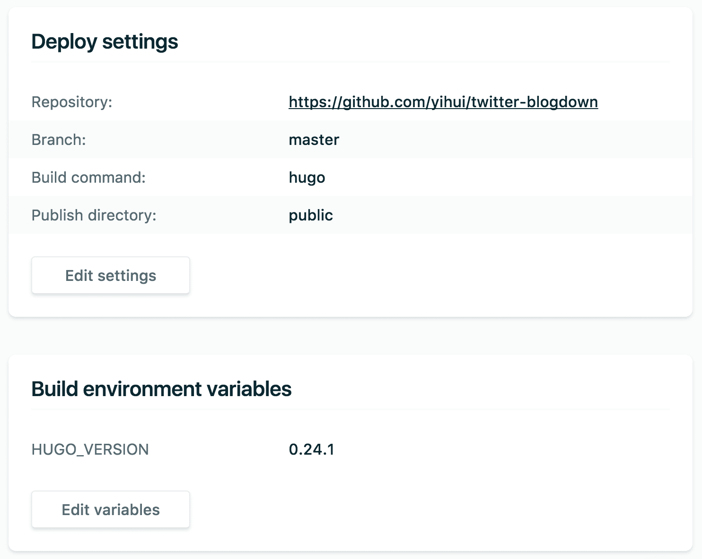

# Deployment

Since the website is basically a folder containing static files, it is much easier to deploy than websites that require dynamic server-side languages such as PHP or databases. All you need is to upload the files to a server, and usually your website will be up and running shortly. The key question is which web server you want to use. If you do not have your own server, you may try the ones listed in this chapter. Most of them are free (except Amazon S3), or at least provide free plans. Disclaimer: the authors of this book are not affiliated with any of these services or companies, and there is no guarantee that these services will be provided forever.^[You can easily find other similar services if you use your search engine.] 

Considering the cost and friendliness to beginners, we currently recommend [Netlify](https://www.netlify.com). It provides a free plan that actually has quite a lot of useful features. If you have no experience in publishing websites before, just log in using your GitHub account or other accounts, drag the `public/` folder built by **blogdown** for your website to the Netlify page, and your website will be online in a few seconds with a random subdomain name of the form `random-word-12345.netlify.com` provided by Netlify (you can customize the name). You can easily automate this process (see Section \@ref(netlify) for more details). You do not need to wrestle with `ssh` or `rsync -zrvce` any more, if you know what these commands mean.

The second easiest solution may be [Updog](https://updog.co), which features Dropbox integration. Publishing a website can be as easy as copying the files under the `public/` folder of your **blogdown** website to a Dropbox folder. The free plan of Updog only provides limited features, and its paid plan will give you access to much richer features.

If you do not mind using command-line tools or are familiar with GIT/GitHub, you can certainly consider services like GitHub pages, Travis CI, or Amazon S3 to build or host your websites. No matter which service you use, please keep in mind that none of them can really lock you and you are always free to change the service. As we have mentioned before, one great advantage of **blogdown** is that your website will be a folder of static files that you can move to any web server.

## Netlify

As we just mentioned, Netlify allows you to quickly publish a website by uploading the `public/` folder through its web interface, and you will be assigned a random subdomain `*.netlify.com`. This approach is good for those websites that are not updated frequently (or at all). However, it is unlikely that you do not need to update your website, so we introduce a better approach in this section,^[Please bear in mind that the purpose of this section is to outline the basic steps of publishing a website with Netlify, and the technical details may change from time to time, so the official Netlify documentation should be the most reliable source if you have any questions or anything we introduced here does not work.] which will take you a few more minutes to complete the configurations. Once it is properly configured, all you need to do in the future is to update the source repository, and Netlify will call Hugo to render your website automatically.

Basically you have to host all source files of your website in a GIT repository. You do not need to put the `public/` directory under version control^[You can add `public` to `.gitignore` to ignore it in GIT.] because it will be automatically generated. Currently Netlify supports GIT repositories hosted on GitHub, GitLab, and BitBucket. With any of these accounts, you can log into Netlify from its homepage and follow the guide to create a new site from your GIT repository.

Netlify supports several static website generators, including Jekyll and Hugo. For a new site, you have to specify a command to build your website, as well as the path of the publish directory. Netlify also supports multiple versions of Hugo, so the build command can be the default `hugo`. The default version is 0.17, which is too old, and we recommend you to use at least version 0.20. To specify a Hugo version greater or equal to 0.20, you need to create an environment variable `HUGO_VERSION` on Netlify. See the [Netlify documentation](https://www.netlify.com/docs/continuous-deployment/) for more information. The publish directory should be `public` unless you have changed it in your `config.toml`. Figure \@ref(fig:netlify-settings) shows the settings of the website https://t.yihui.name. You do not have to follow the exact settings for your own website.

```{r netlify-settings, fig.cap='Example settings of a website deployed on Netlify.', echo=FALSE, fig.align='center', out.width='100%'}

```

It may take a minute or two to deploy your website on Netlify for the first time, but it can be much faster later (a few seconds) when you update your website source, because Netlify deploys incremental changes in the `public/` directory, i.e., only the newer files compared  to the last time are deployed.

After your GIT repository is connected with Netlify, the last issue you may want to solve is the domain name, unless you are satisfied with the free Netlify subdomain. If you want to use a different domain, you need to configure some DNS records of the domain to point it to the Netlify server. See Appendix \@ref(domain-name) for some background knowledge on domain names.

If you are not familiar with domain names or do not want to learn more about them, something to consider is a free subdomain `*.rbind.io` offered by RStudio, Inc. Please visit the Rbind support website <https://support.rbind.io> to learn how to apply for a subdomain. In fact, the Rbind organization also offers free help on how to set up a website based on **blogdown**, thanks to a lot of volunteers from the R and statistics community.

Netlify is the only solution in this chapter that does not require you to prebuild your website. You only need to update the source files, push them to GitHub, and Netlify will build the website for you.^[This is called "continuous deployment".] The rest of the solutions in this chapter will require you to build your website locally and upload the `public/` folder explicitly or implicitly. That said, you can certainly prebuild your website using any tools, push it to GitHub, and Netlify is still able to deploy it for you. What you need to do is to leave the build command empty, and tell Netlify your publish directory (e.g., Hugo's default `public/`). Then Netlify simply uploads all files under this directory to its servers.

## Updog

[Updog](https://updog.co) provides a simple service: it turns a specified Dropbox (or Google Drive) folder into a website. The idea is that you grant Updog the permission to read the folder, and it will act as a middleman to serve your files under this folder to your visitors. This folder has to be accessed via a domain name, and Updog offers a free subdomain `*.updog.co`. For example, if you have assigned the domain `example.updog.co` to your Dropbox folder, and a visitor wants to see the page `https://example.updog.co/foo/index.html`, Updog will read the file `foo/index.html` in your Dropbox folder and display it to the visitor.

At the moment, the free plan of Updog only allows one website per account, and will insert a footer "Hosted on UpDog" on your web pages. You may not like these limitations. The major benefit of using Updog is that publishing a website becomes implicit since Dropbox will continuously sync files. All you need to do is to make sure your website is generated to the correct Dropbox folder. This can be easily achieved by setting the option `publishDir` in `config.toml`. For example, suppose the folder that you assign to Updog is `~/Dropbox/Apps/updog/my-website/`, and your source folder is at `~/Dropbox/Apps/updog/my-source/`, then you can set `publishDir: "../my-website"` in `~/Dropbox/Apps/updog/my-source/config.toml`.

You can also use your custom domain name if you do not want the default Updog subdomain, and you only need to point the CNAME record of your domain name to the Updog subdomain.

## GitHub pages

[GitHub pages](https://pages.github.com/) is a very popular way to host static websites (especially those built with Jekyll), but its advantages are not obvious or appealing compared to Netlify. We recommend you to consider Netlify + Hugo due to these reasons:

- Currently GitHub pages does not support HTTPS for custom domain names. HTTPS only works for `*.github.io` subdomains. This limitation does not exist on Netlify. You may read the article "[Why HTTPS for Everything?](https://https.cio.gov/everything/)" to know why it is important, and you are encouraged to turn on HTTPS for your website whenever you can.

- Redirecting URLs is awkward with GitHub pages but much more straightforward with Netlify.^[GitHub pages uses a Jekyll plugin to write an `HTTP-REFRESH` meta tag to redirect pages, and Netlify can do pattern-based 301 or 302 redirects, which can notify search engines that certain pages have been moved (permanently or temporarily).] This is important especially when you have an old website that you want to migrate to Hugo; some links may be broken, in which case you can easily redirect them with Netlify.

- One of the best features of Netlify that is not available with GitHub pages is that Netlify can generate a unique website for preview when a GitHub pull request is submitted to your GitHub repository. This is extremely useful when someone else (or even yourself) proposes changes to your website, since you have a chance to see what the website would look like before you merge the pull request.

Basically Netlify can do everything that GitHub pages can, but there is still one little missing feature, which is closely tied to GitHub itself. That is GitHub [Project Pages](https://help.github.com/articles/user-organization-and-project-pages/). This feature allows you to have project websites in separate repositories, e.g., you may have two independent websites `https://username.github.io/proj-a/` and `https://username.github.io/proj-b/`, corresponding to GitHub repositories `username/proj-a` and `username/proj-b`, respectively. However, since you can connect any GitHub repositories with Netlify, and each repository can be associated with a domain or subdomain name, you may replace GitHub Project Pages with different subdomains like `proj-a.netlify.com` and `proj-b.netlify.com`. The actual limitation is that you cannot use subpaths in the URL but you can use any (sub)domain names.

Although GitHub does not officially support Hugo (only Jekyll is supported), you can actually publish any static HTML files on GitHub pages, even if they are not built with Jekyll. The first requirement of using GitHub pages is that you have to create a GitHub repository named `username.github.io` under your account (replace `username` with your actual GitHub username), and what's left is to push your website files to this repository. The comprehensive documentation of GitHub pages is at https://pages.github.com, and please ignore anything related to Jekyll there unless you actually use Jekyll instead of Hugo. To make sure GitHub does not rebuild your website using Jekyll and just publish whatever files you push to the repository, you need to create a (hidden) file named `.nojekyll` in the repository.^[You may use the R function `file.create('.nojekyll')` to create this file if you do not know how to do this.] GitHub offers a free subdomain `username.github.io`, and you can use your own domain name by configuring its A or CNAME records to point it to GitHub pages (consult the GitHub pages documentation for how).

Your `public/` directory should be the GIT repository. You have two possible choices of setting up this repository locally. The first choice is to follow the default structure of a Hugo website like the diagram below, and initialize the GIT repository under the `public/` directory:

```bash
source/
│
├── config.toml
├── content/
├── themes/
├── ...
└── public/
    |
    ├── .git/
    ├── .nojekyll
    ├── index.html
    ├── about/
    └── ...
```

If you know how to use the command line, change the working directory to `public/`, and initialize the GIT repository there:

```bash
cd public
git init
git remote add origin https://github.com/username/username.github.io
```

The other choice is to clone the GitHub repository you created to the same directory as your website source:

```bash
git clone https://github.com/username/username.github.io
```

And the structure looks like this:

```bash
source/
│
├── config.toml
├── content/
├── themes/
└── ...

username.github.io/
│
├── .git/
├── .nojekyll
├── index.html
├── about/
└── ...
```

The source directory and the `username.github.io` directory are under the same parent directory. In this case, you need to set the option `publishDir: "../username.github.io"` in `source/config.toml`.

## Travis + GitHub

If you decide not to follow our recommendation to use Netlify to deploy your website, we should warn you that the approach in this section will require substantial knowledge about GIT, GitHub, [Travis CI](https://travis-ci.org), and the Linux command line, which we will leave for you to learn on your own. The major advantage of publishing via Travis CI is that you can compile all your Rmd posts on Travis CI (on the cloud) instead of your local computer.

In case you are not familiar with Travis, it is a service to continuously check your software in a virtual machine whenever you push changes to GitHub. It is primarily for testing software, but since you can run a lot of commands in its virtual machine, you can certainly use the virtual machine to do other things, e.g., install R and the **blogdown** package to build websites. Before I show you how, I'd like to mention two issues that you should be aware of:

- Personally, I prefer taking a look at the output in GIT to see the changes when I have any output that is dynamically computed from R, so that I know for sure what I'm going to publish exactly. With Travis, it is somewhat unpredictable because it is fully automatic and you do not have a chance to see the new content or results to be published. There are many factors that could affect building the site: the R version, availability of certain R packages, system dependencies, and network connection, etc.

- The time required to compile all Rmd files may be very long and cause timeouts on Travis, depending on how time-consuming your R code is. There is a caching mechanism in **blogdown** to speed up the building of your site (see Section \@ref(methods)), and if you use Travis to build your website, you will not benefit from this caching mechanism unless you take advantage of Travis' caching. You have to cache the directories `content/`, `static/`, and `blogdown/`, but Travis' cache is a little fragile in my experience. Sometimes the cache may be purged for unknown reasons. What is more, you cannot directly cache `content/` and `static/`, because Travis clones your repository before restoring the cache, which means old files from the cached `content/` and `static/` may overwrite new files you pushed to GitHub.

The second problem can be solved, but I do not want to explain how in this book since the solution is too involved. If you really want to use Travis to build your website and run into the problem, you may file an issue to the GitHub repository https://github.com/yihui/travis-blogdown. In fact, this repository is a minimal example I created to show how to build a website on Travis and publish to GitHub Pages.

The Travis documentation shows how to deploy a site to GitHub Pages: https://docs.travis-ci.com/user/deployment/pages/, but does not show how to build a site. Here is the Travis configuration file, `.travis.yml`, for the `travis-blogdown` repository:

```yaml
language: r
dist: trusty
sudo: false

branches:
  only:
    - master

cache:
  packages: yes
  directories:
    - $HOME/bin

before_script:
  - "Rscript -e 'blogdown::install_hugo()'"

script:
  - "Rscript -e 'blogdown::build_site()'"

deploy:
  provider: pages
  skip_cleanup: true
  github_token: $GITHUB_TOKEN
  on:
    branch: master
  local_dir: public
  fqdn: travis-blogdown.yihui.name
```

The key is that we install Hugo via `blogdown::install_hugo()` and build the site via `blogdown::build_site()`. To trick Travis into building this repository like an R package, you must have a `DESCRIPTION` file in the repository, otherwise your website will not be built.

```yaml
Package: placeholder
Type: Website
Title: Does not matter.
Version: 0.0.1
Imports: blogdown
Remotes: rstudio/blogdown
```

There are a few more things to explain and emphasize in `.travis.yml`:

- The `branches` option specifies that only changes in the `master` branch will trigger building on Travis.

- The `cache` option specifies all R packages to be cached, so the next time it will be faster to build the site (R packages do not need to be reinstalled from source). The `bin/` directory in the home directory is also cached because Hugo is installed there, and the next time Hugo does not need to be reinstalled.

- For the `deploy` option, there is an environment variable named `GITHUB_TOKEN`, and I have specified its value to be a GitHub personal access token via the Travis settings of this repository, so that Travis will be able to write to my repository after the website is built. The option `on` specifies that the deployment will only occur when the `master` branch is built. The `local_dir` option is the publish directory, which should default to `public` in Hugo. By default, the website is pushed to the `gh-pages` branch of this repository. The `fqdn` option specifies the custom domain of the website. I have set a CNAME record (see Appendix \@ref(domain-name)) to point `travis-blogdown.yihui.name` to `yihui.github.io`, so that GitHub is able to serve this website through this domain (in fact, Travis will write a `CNAME` file containing the domain to the `gh-pages` branch).

If you use the `username.github.io` repository on GitHub, the website must be pushed to its `master` branch instead of `gh-pages` (this is the only exception). What I recommend you to do is to separate the source repository and the output repository. For example, you may have a `website-source` repository with the same settings as the above `.travis.yml` except two new options under `deploy`:

```yaml
deploy:
  ...
  repo: username/username.github.io
  target_branch: master
```

This means the website will be pushed to the `master` branch of the repository `username/username.github.io` (remember to replace `username` with your actual user name).

You can also deploy your website to Amazon S3, and the setup on the R side is very similar to what we have introduced for GitHub Pages. The only difference is in the last step, where you change the target from GitHub Pages to Amazon S3. For more information, please see the documentation on Travis: https://docs.travis-ci.com/user/deployment/s3/.
