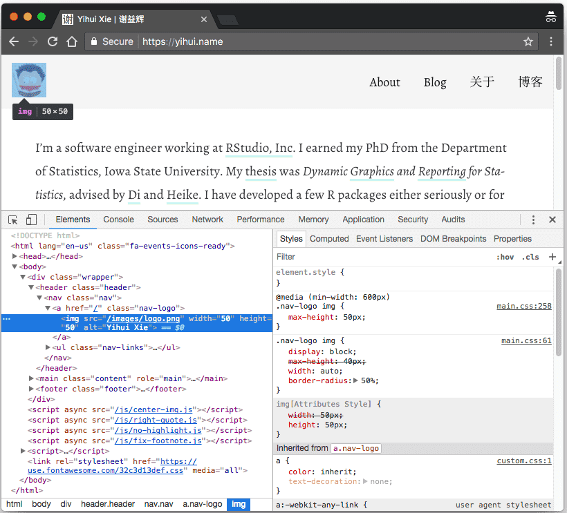

\cleardoublepage 

# (APPENDIX) Appendix {-}

# Website Basics

If you want to tweak the appearance of your website, or even design your own theme, you must have some basic knowledge for web development. In this chapter, we briefly introduce HTML, CSS, and JavaScript, which are the most common components of a web page, although CSS and JavaScript are optional.

We only aim at getting you started with HTML, CSS, and JavaScript. HTML is relatively simple to learn, but CSS and JavaScript can be much more complicated, depending on how much you want to learn and what you want to do with them. After reading this chapter, you will have to use other resources to teach yourself. When you search for these technologies online, the most likely websites that you may hit are [MDN](https://developer.mozilla.org) (Mozilla Developer Network), [w3schools.com](https://www.w3schools.com), and [StackOverflow](https://stackoverflow.com). Among these websites, w3schools often provides simple examples and tutorials that may be more friendly to beginners, but we often hear [negative comments](https://meta.stackoverflow.com/q/280478/559676) about it, so please use it with your own caution. I often read all three websites when looking for solutions.

If we were only allowed to give one single most useful tip about web development, it would be: use the "Developer Tools" of your web browser. Most modern web browsers provde these tools. For example, you can find these tools from the menu of Google Chrome `View -> Developer`, Firefox's menu `Tools -> Web Developer`, or Safari's menu `Develop -> Show Web Inspector`. Figure \@ref(fig:chrome-devtools) is a screenshot of using the Developer Tools in Chrome.

```{r chrome-devtools, fig.cap='Developer Tools in Google Chrome.', fig.align='center', out.width='100%', echo=FALSE}

```

Typically you can also open the Developer Tools by right-clicking on a certain element on the web page and selecting the menu item `Inspect` (or `Inspect Element`). In Figure \@ref(fig:chrome-devtools), I right-clicked on the profile image of my website https://yihui.name and inspected it, and Chrome highlighted its HTML source code `` in the left pane. You can also see the CSS styles associated with this `img` element in the right pane. What is more, you can interactively change the styles there if you know CSS, and see the (temporary) effects in real time on the page! After you are satisfied with the new styles, you can write the CSS code in files.

There are a lot of amazing features of Developer Tools, which make them not only extremely useful for debugging and experimentation, but also helpful for learning web development. These tools are indispensable to me when I develop anything related to web pages. I learned a great deal about CSS and JavaScript by playing in these tools.

## HTML

HTML stands for Hyper Text Markup Language, and it is the language behind most web pages you see. You can use the menu `View -> View Source` or the context menu `View Page Source` to see the full HTML source of a web page in your browser. All elements on a page are represented by HTML tags. For example, the tag `<p>` represents paragraphs, and `` represents images.

The good thing about HTML is that the language only has a limited number of tags, and the number is not very big (especially the number of commonly used tags). This means there is hope that you can master this language fully and quickly.

Most HTML tags appear in pairs, with an opening tag and an closing tag, e.g., `<p></p>`. You write the content between the opending and closing tag, e.g., `<p>This is a paragraph.</p>`. There are a few exceptions, such as the `` tag, which can be closed by a slash `/` in the opening tag, e.g., ``. You can specify attributes of an element in the opening tag using the syntax `name=value` (a few attributes do not require `value`).

HTML documents often have the filename extension `.html` (or `.htm`). Below is an overall structure of an HTML document:

```html
<html>

  <head>
  </head>
  
  <body>
  </body>

</html>
```

Basically an HTML document consists a `head` section and `body` section. You can specify the metadata and include assets like CSS files in the `head` section. Normally the `head` section is not visible on a web page. It is the `body` section that holds the content to be displayed to a reader. Below is a slightly richer example document:

```html
<!DOCTYPE html>
<html>

  <head>
    <meta charset="utf-8" />
    
    <title>Your Page Title</title>
    
    <link rel="stylesheet" href="/css/style.css" />
  </head>
  
  <body>
    <h1>A First-level Heading</h1>
    
    <p>A paragraph.</p>
    
    
    
    <ul>
      <li>An item.</li>
      <li>Another item.</li>
      <li>Yet another item.</li>
    </ul>
    
    <script src="/js/bar.js"></script>
  </body>

</html>
```

In the head, we declare the character encoding of this page to be UTF-8 via a `<meta>` tag, specify the title via the `<title>` tag, and include a stylesheet via a `<link>` tag.

The body contains a first-level section heading `<h1>`,^[There are six possible levels from `h1`, `h2`, ..., to `h6`.] a paragraph `<p>`, an image ``, an unordered list `<ul>` with three list items `<li>`, and includes a JavaScript file in the end via `<script>`.

There are much better tutorials on HTML than this section, such as those offered by MDN and w3schools.com, so we are not going to make this section a full tutorial. Instead, we just want to provide a few tips on HTML:

- You may validate your HTML code via this service: https://validator.w3.org. This validator will point out potential problems of your HTML code. It actually works for XML and SVG documents, too.

- Among all HTML attributes, file paths (the `src` attribute of some tags like ``) and links (the `href` attribute of the `<a>` tag) may be the most confusing to beginners. Paths and links can be relative or absolute, and may come with or without the protocol and domain. You have to understand what a link or path exactly points to. A full link is of the form `http://www.example.com/foo/bar.ext`, where `http` specifies the protocol (it can be other protocols like `https` or `ftp`), `www.example.com` is the domain, `foo/bar.ext` is the file under the root directory of the website.

    - If you refer to resources on the same website (the same protocal and domain), we recommend you to omit the protocol and domain names, so that the links will continue to work even if you change the protocol or domain. For example, a link `<a href="/hi/there.html">` on a page `http://example.com/foo/` refers to `http://example.com/hi/there.html`. It does not matter if you change `http` to `https`, or `example.com` to `another-domain.com`.
    
    - Within the same website, a link or path can be relative or absolute. The meaning of an absolute path does not change no matter where the current HTML file is placed, but the meaning of a relative path depends on the location of the current HTML file. Suppose you are currently viewing the page `example.com/hi/there.html`:

        - A absolute path `/foo/bar.ext` always means `example.com/foo/bar.ext`. The leading slash means the root directory of the website.
        
        - A relative path `../images/foo.png` means `example.com/images/foo.png` (`..` means to go one level up). However, if the HTML file `there.html` is moved to `example.com/hey/again/there.html`, this path in `there.html` will refer to `example.com/hey/images/foo.png`.
        
        - When deciding whether to use relative or absolute paths, here is the rule of thumb: if you will not move the resources referred or linked to from one subpath to another (e.g., from `example.com/foo/` to `example.com/bar/`), but only move the HTML pages that use these resources, use absolute paths; if you want to change the subpath of the URL of your website, but the relative locations of HTML files and the resources they use do not change, you may use relative links (e.g., you can move the whole website from `example.com/` to `example.com/foo/`).
        
        - If the above concepts sound too complicated, a better way is to either think ahead carefully about the structure of your website and avoid moving files, or use rules of redirects if supported (such as 301 or 302 redirects).
    
    - If you link to a different website or web page, you have to include the domain in the link, but it may not be necessary to include the protocol, e.g., `//test.example.com/foo.css` is a valid path. The actual protocol of this path matches the protocol of the current page, e.g., if the current page is `https://example.com/`, this link means `https://test.example.com/foo.css`. It may be benefitial to omit the protocol because HTTP resources cannot be embedded on pages served through HTTPS (for security reasons), e.g., an image at `http://example.com/foo.png` cannot be embedded on a page `https://example.com/hi.html` via ``, but `` will work if the image can be accessed via HTTPS, i.e., `https://example.com/foo.png`. The main drawback of not including the protocol is that such links and paths do not work if you open the HTML file locally without using a web server, e.g., only double-click the HTML file in your file browser and show it in the browser.^[That is because without a web server, an HTML file is viewed via the protocol `file`. For example, you may see a URL of the form `file://path/to/the/file.html` in the address bar of your browser. The path `//example.com/foo.png` will be interpreted as `file://example.com/foo.png`, which is unlikely to exist as a local file on your computer.]

## CSS

## JavaScript
