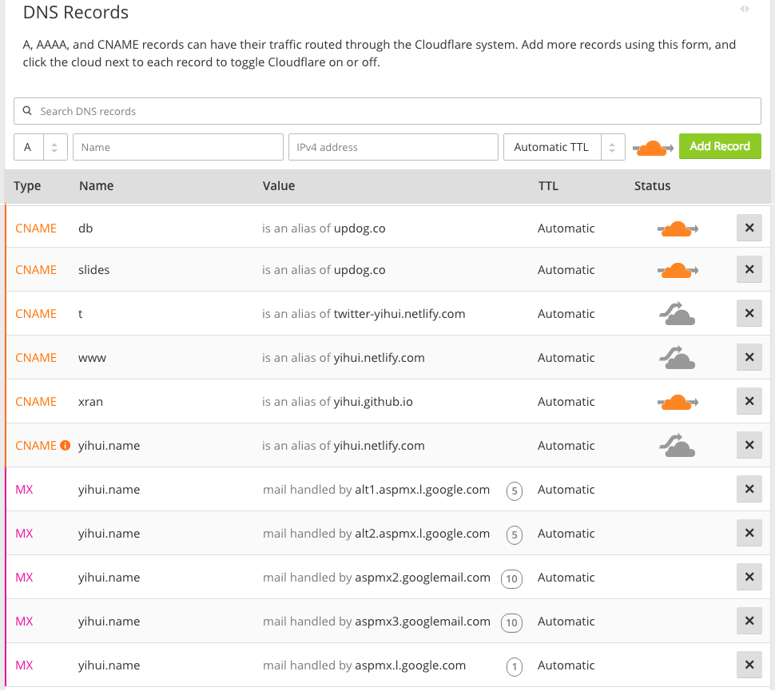

# Domain Name

While you can use the free subdomain names like those provided by GitHub or Netlify, it may be a better idea to own a domain name of your own. The cost of an apex domain is minimal (typically the yearly cost is about 10 US dollars), and you will enter a much richer world after you purchase a domain name. For example, you are free to point your domain to any web servers, you can create as many subdomain names as you want, and you can even set up your own email accounts using the domain or subdomains. In this chapter, we will explain some basic concepts of domain names, and mention a few (free) services to help you configure your domain name.

Before we dive into the details, we want to outline the big picture of how a URL works in your web browser. Suppose you typed or clicked a link `http://www.example.com/foo/index.html` in your web browser. What happens behind the scenes before you see the actual web page?

First, the domain name has to be resolved through the nameservers associated with it. A nameserver knows the DNS (Domain Name System) records of a domain. Typically it will look up the "A records" to point the domain to the IP address of a web server. There are several other types of DNS records, and we will explain them later. Once the web server is reached, the server will look for the file `foo/index.html` under a directory associated with the domain name, and return its content in the response. That is basically how you can see a web page.

## Registration

You can purchase a domain name from many domain name registrars. To stay neutral, we are not going to make recommendations here. You can use your search engine to find a registrar by yourself, or ask your friends for recommendations. However, we would like to remind you of a few things that you should pay attention to when looking for a domain name registrar:

- You should have the freedom to transfer your domain from the current registrar to other registrars, i.e., they should not lock you in their system. To transfer a domain name, you should be given a code known as the "Transfer Auth Code" or "Auth Code" or "Transfer Key" or something like that.

- You should be able to customize the nameservers (see Section \@ref(nameservers)) of your domain. By default, each registrar will assign their own nameservers to you, and these nameservers typically work very well. However, there are some special nameservers that provide services more than just DNS records, and you may be interested in using them.

- Other people can freely look up your personal information such as your email or postal address after you register a domain and submit this information to the registrar. This is called the "WHOIS Lookup". You may want to protect your privacy, but your registrar may require an extra payment.

## Nameservers

The main reason why we need nameservers is that we want to use domains instead of IP addresses, although a domain is not strictly necessary for you to be able to access a website. You could use the IP address if you have your own server with a public IP, but there are many problems with this approach. For example, IP addresses are limited (in particular IPv4), not easy to memorize, and you can only host one website per IP address (without using other ports).

A nameserver is an engine that directs the DNS records of your domain. The most common DNS record is the A record, which maps a domain to an IP address, so that the hosting server can be found via its IP address when a website is accessed through a domain. We will introduce two more types of DNS records in Section \@ref(dns-records): CNAME and MX records.

In most cases, the default nameservers provided by your domain registrar should suffice, but there is a special technology missing in most nameservers: CNAME flattening. You only need this technology if you want to set a CNAME record for your apex domain. The only use case to my knowledge is when you host your website via Netlify, but want to use the apex domain instead of the `www` subdomain, e.g., you want to use `example.com` instead of `www.example.com`. To make use of this technology, you could consider [Cloudflare](https://www.cloudflare.com), which provides this DNS feature for free. Basically, all you need to do is to point the nameservers of your domain to the nameservers provided by Cloudflare (of the form `*.ns.cloudflare.com`).

## DNS records

There are many types of DNS records, and you may see a full list on [Wikipedia](https://en.wikipedia.org/wiki/List_of_DNS_record_types). The most commonly used types may be A, CNAME, and MX records. Figure \@ref(fig:cloudflare-dns) has shown a subset of DNS records of my domain `yihui.name` on Cloudflare, which may give you an idea of what DNS records look like. You may query DNS records using command-line tools such as [`dig`](https://en.wikipedia.org/wiki/Dig_(command)) or an app provided by Google: https://toolbox.googleapps.com/apps/dig/.

```{r cloudflare-dns, fig.cap='Some DNS records of the domain yihui.name on Cloudflare.', fig.align='center', out.width='100%', echo=FALSE}

```

An apex domain can have any number of subdomains. You can set DNS records for the apex domain and any subdomains. You can see from Figure \@ref(fig:cloudflare-dns) that I have several subdomains, e.g., `slides.yihui.name` and `xran.yihui.name`.

As we have mentioned, an A record points a domain or subdomain to an IP address of the host server. I did not use any A records for my domains since all services I use, such as Updog, GitHub Pages, and Netlify, support CNAME records well. A CNAME record is an alias, pointing one domain to another domain. The advantage of using CNAME over A is that you do not have to tie a domain to a fixed IP address. For example, the CNAME record for `t.yihui.name` is `twitter-yihui.netlify.com`. The latter domain is provided by Netlify, and I do not need to know where they actually host the website. They are free to move the host of `twitter-yihui.netlify.com`, and I will not need to update my DNS record. Every time someone visits the website `t.yihui.name`, the web browser will route the traffic to the domain set in the CNAME record. Note that this is different to redirection, i.e., the URL `t.yihui.name` will not be explicitly redirected to `twitter-yihui.netlify.com` (you still see the former in the address bar of your browser).

Normally, you can set any DNS records for the apex domain except CNAME, but I set a CNAME record for my apex domain `yihui.name`, and that is because Cloudflare supports CNAME flattening. For more information on this topic, you may read the post "[To WWW or not WWW](https://www.netlify.com/blog/2017/02/28/to-www-or-not-www/)" by Netlify. Personally, I prefer not using the subdomain `www.yihui.name` to keep my URLs short, so I set a CNAME record for both the apex domain `yihui.name` and the `www` subdomain, and Netlify will automatically redirect the `www` subdomain to the apex domain. That said, if you are a beginner, it may be a little easier to configure and use the `www` subdomain, as suggested by Netlify. Note `www` is only a conventional subdomain that sounds like an apex domain but it really is not, and it is okay no matter if you want to follow this convention or not.

For email services, I was an early enough "[netizen](https://en.wikipedia.org/wiki/Netizen)", and when I registered my domain name, Google was still offering free email services to custom domain owners. That is how I can have a custom mailbox `xie@yihui.name`. Now you will have to pay for [G Suite](https://gsuite.google.com). In Figure \@ref(fig:cloudflare-dns) you can see I have set some MX (stands for "mail exchange") records which point to some Google mail servers. Of course, Google is not the only possible choice when it comes to custom mailboxes. [Migadu](https://www.migadu.com) claims to be the "most affordable email hosting". You may try its free plan and see if you like it. Unless you are going to use your custom mailbox extensively and for professional purposes, the free plan may suffice. In fact, you may create an alias address on Migadu to forward emails to your other email accounts (such as Gmail) if you do not care about an actual custom mailbox. Migadu has provided detailed instructions on how to set the MX records for your domain.
